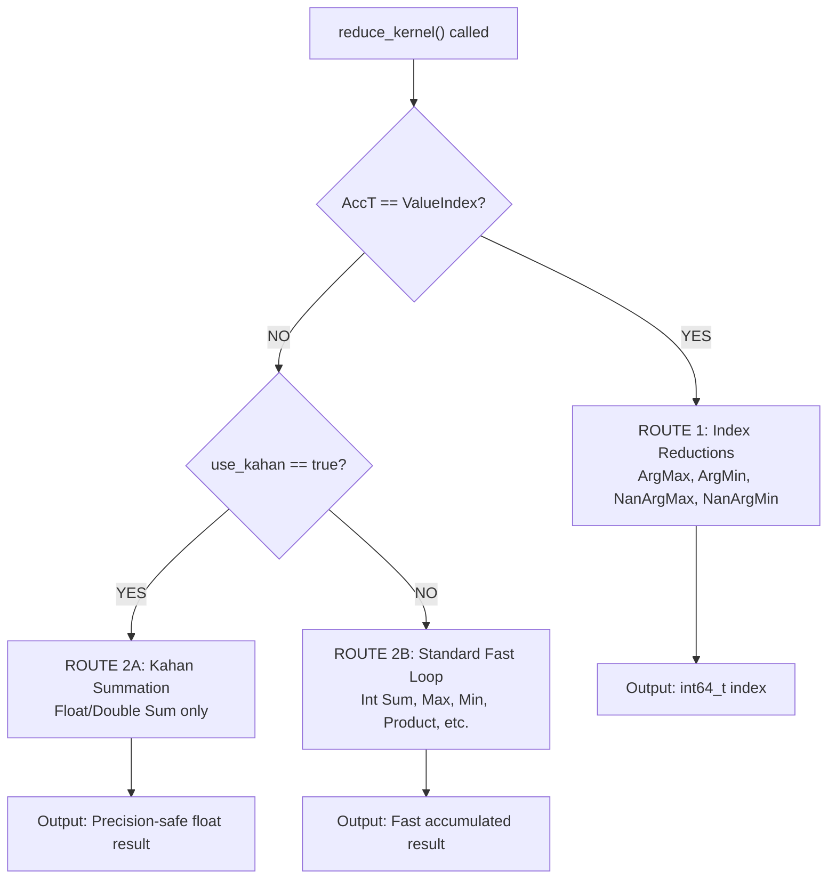
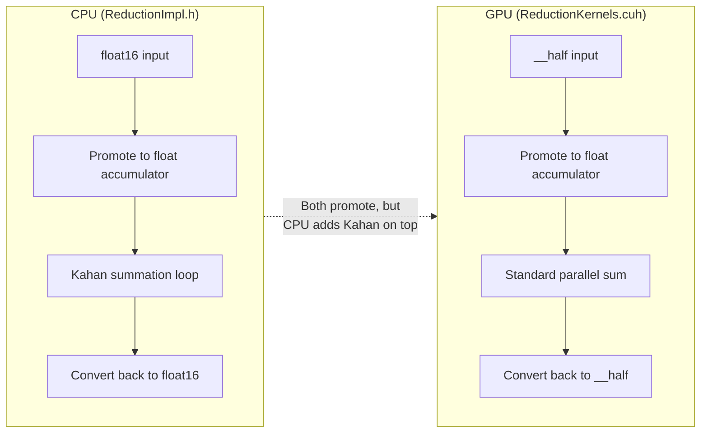
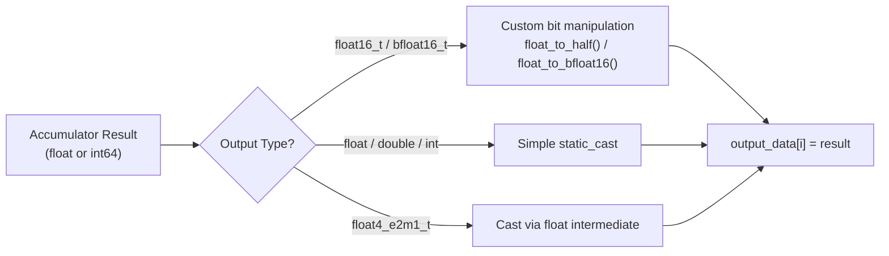

# Kahan Summation & CPU Reduction Routing in `master_gau`

> **File:** [ReductionImpl.h](file:///home/blu-bridge016/Downloads/Neural_Networks_exp_1926/master_gau/include/ops/helpers/ReductionImpl.h)

---

## Decision Tree (Mindmap)



---

## TL;DR: The 3 Routes

### 🔵 Route 1 — Index Reductions
- **Operations:** [ArgMax](file:///home/blu-bridge016/Desktop/Neural_Networks_exp_1926/tensor_centric_tensorlib/include/ops/helpers/ReductionOps.h#703-746), [ArgMin](file:///home/blu-bridge016/Downloads/Neural_Networks_exp_1926/master_gau/include/ops/helpers/ReductionOps.h#660-705), [NanArgMax](file:///home/blu-bridge016/Downloads/Neural_Networks_exp_1926/master_gau/include/ops/helpers/ReductionOps.h#800-847), [NanArgMin](file:///home/blu-bridge016/Downloads/Neural_Networks_exp_1926/master_gau/include/ops/helpers/ReductionOps.h#752-799)  
- **Accumulator:** `ValueIndex<T>` (a struct with `.value` + `.index`)  
- **Loop Logic:** Tracks both the extreme value AND its position  
- **Output:** [int64_t](file:///home/blu-bridge016/Downloads/Neural_Networks_exp_1926/master_gau/include/ops/helpers/ReductionOps.h#274-275) (the index, not the value)

### 🟢 Route 2A — Kahan Summation
- **Operations:** [SumOp](file:///home/blu-bridge016/Desktop/Neural_Networks_exp_1926/tensor_centric_tensorlib/include/ops/helpers/ReductionOps.h#302-335) only  
- **Data Types:** [float](file:///home/blu-bridge016/Desktop/Neural_Networks_exp_1926/tensor_centric_tensorlib/include/dtype/Types.h#299-300), [double](file:///home/blu-bridge016/Downloads/Neural_Networks_exp_1926/tensorflow/tensorflow/core/kernels/reduction_gpu_kernels.cu.h#110-124), [float16_t](file:///home/blu-bridge016/Desktop/Neural_Networks_exp_1926/tensor_centric_tensorlib/include/dtype/Types.h#299-300), [bfloat16_t](file:///home/blu-bridge016/Desktop/Neural_Networks_exp_1926/tensor_centric_tensorlib/include/dtype/Types.h#199-200)  
- **Accumulator:** Two variables — `kahan_sum` + `kahan_c` (error register)  
- **Loop Logic:** 4-step error-compensated addition  
- **Output:** Precision-perfect sum (no absorption errors)  
- **Platform:** CPU only (GPU uses Double Accumulation instead)

### 🟡 Route 2B — Standard Fast Loop  
- **Operations:** Everything else — [Max](file:///home/blu-bridge016/Downloads/Neural_Networks_exp_1926/tensorflow/tensorflow/core/kernels/reduction_gpu_kernels.cu.h#1002-1010), [Min](file:///home/blu-bridge016/Downloads/Neural_Networks_exp_1926/tensorflow/tensorflow/core/kernels/reduction_gpu_kernels.cu.h#1011-1019), [Product](file:///home/blu-bridge016/Downloads/Neural_Networks_exp_1926/master_gau/include/ops/helpers/ReductionOps.h#337-363), [NanSum](file:///home/blu-bridge016/Desktop/Neural_Networks_exp_1926/tensor_centric_tensorlib/include/ops/helpers/ReductionOps.h#493-515), [NanProduct](file:///home/blu-bridge016/Downloads/Neural_Networks_exp_1926/master_gau/include/ops/helpers/ReductionOps.h#517-539), `NanMin`, `NanMax`, **Integer Sum**  
- **Accumulator:** Single variable via `op.identity()`  
- **Loop Logic:** Simple `accumulator = op.reduce(accumulator, value)`  
- **Output:** Fast result with type-promoted overflow safety

---

## Route Selection: The 4 Conditions for Kahan

```cpp
// Line 191-194 of ReductionImpl.h
constexpr bool use_kahan = 
    std::is_same_v<OpType<T>, SumOp<T>>           // Condition 1
    && !std::is_same_v<AccT, ValueIndex<T>>        // Condition 2
    && (std::is_floating_point_v<AccumulatorT>     // Condition 3
        || std::is_same_v<AccumulatorT, double>);  // Condition 4
```

| # | Condition | Purpose | Fails For |
|---|-----------|---------|-----------|
| 1 | `OpType == SumOp` | Kahan only works for addition | Max, Min, Product |
| 2 | `AccT != ValueIndex` | Can't do Kahan on a struct | ArgMax, ArgMin |
| 3 | `is_floating_point_v` | Integers have no rounding errors | int32, int64, bool |
| 4 | `is_same_v<..., double>` | Safety net for custom aliases | *(redundant but defensive)* |

> [!NOTE]
> Conditions 3 and 4 overlap for native [double](file:///home/blu-bridge016/Downloads/Neural_Networks_exp_1926/tensorflow/tensorflow/core/kernels/reduction_gpu_kernels.cu.h#110-124). Condition 4 exists as **defensive programming** — it guarantees [double](file:///home/blu-bridge016/Downloads/Neural_Networks_exp_1926/tensorflow/tensorflow/core/kernels/reduction_gpu_kernels.cu.h#110-124) is never accidentally excluded if someone modifies Condition 3, and it catches custom type aliases that `is_floating_point_v` might miss.

---

## Routing Table: Every Scenario

| Operation | Input Type | Route | Why? |
|-----------|-----------|-------|------|
| **Sum** | [float](file:///home/blu-bridge016/Desktop/Neural_Networks_exp_1926/tensor_centric_tensorlib/include/dtype/Types.h#299-300) |  **2A (Kahan)** | All 4 conditions pass |
| **Sum** | [double](file:///home/blu-bridge016/Downloads/Neural_Networks_exp_1926/tensorflow/tensorflow/core/kernels/reduction_gpu_kernels.cu.h#110-124) |  **2A (Kahan)** | All 4 conditions pass |
| **Sum** | [float16_t](file:///home/blu-bridge016/Desktop/Neural_Networks_exp_1926/tensor_centric_tensorlib/include/dtype/Types.h#299-300) |  **2A (Kahan)** | Promoted to [float](file:///home/blu-bridge016/Desktop/Neural_Networks_exp_1926/tensor_centric_tensorlib/include/dtype/Types.h#299-300) accumulator, Cond 3 passes |
| **Sum** | [bfloat16_t](file:///home/blu-bridge016/Desktop/Neural_Networks_exp_1926/tensor_centric_tensorlib/include/dtype/Types.h#199-200) |  **2A (Kahan)** | Promoted to [float](file:///home/blu-bridge016/Desktop/Neural_Networks_exp_1926/tensor_centric_tensorlib/include/dtype/Types.h#299-300) accumulator, Cond 3 passes |
| **Sum** | [int32](file:///home/blu-bridge016/Desktop/Neural_Networks_exp_1926/tensor_centric_tensorlib/include/ops/helpers/ReductionOps.h#273-274) |  **2B (Normal)** | Cond 3 fails: [int64_t](file:///home/blu-bridge016/Downloads/Neural_Networks_exp_1926/master_gau/include/ops/helpers/ReductionOps.h#274-275) is not floating point |
| **Sum** | [int64](file:///home/blu-bridge016/Downloads/Neural_Networks_exp_1926/master_gau/include/ops/helpers/ReductionOps.h#274-275) |  **2B (Normal)** | Cond 3 fails |
| **Sum** | [bool](file:///home/blu-bridge016/Downloads/Neural_Networks_exp_1926/master_gau/include/ops/helpers/ReductionImpl.h#73-94) |  **2B (Normal)** | Cond 3 fails: [int64_t](file:///home/blu-bridge016/Downloads/Neural_Networks_exp_1926/master_gau/include/ops/helpers/ReductionOps.h#274-275) accumulator |
| **Max** | [float](file:///home/blu-bridge016/Desktop/Neural_Networks_exp_1926/tensor_centric_tensorlib/include/dtype/Types.h#299-300) |  **2B (Normal)** | Cond 1 fails: not [SumOp](file:///home/blu-bridge016/Desktop/Neural_Networks_exp_1926/tensor_centric_tensorlib/include/ops/helpers/ReductionOps.h#302-335) |
| **Min** | [double](file:///home/blu-bridge016/Downloads/Neural_Networks_exp_1926/tensorflow/tensorflow/core/kernels/reduction_gpu_kernels.cu.h#110-124) |  **2B (Normal)** | Cond 1 fails |
| **Product** | [float](file:///home/blu-bridge016/Desktop/Neural_Networks_exp_1926/tensor_centric_tensorlib/include/dtype/Types.h#299-300) |  **2B (Normal)** | Cond 1 fails |
| **NanSum** | [float](file:///home/blu-bridge016/Desktop/Neural_Networks_exp_1926/tensor_centric_tensorlib/include/dtype/Types.h#299-300) |  **2B (Normal)** | Cond 1 fails: `NanSumOp ≠ SumOp` |
| **ArgMax** | [float](file:///home/blu-bridge016/Desktop/Neural_Networks_exp_1926/tensor_centric_tensorlib/include/dtype/Types.h#299-300) |  **1 (Index)** | `AccT == ValueIndex<T>`, never reaches Cond 1 |
| **ArgMin** | [int32](file:///home/blu-bridge016/Desktop/Neural_Networks_exp_1926/tensor_centric_tensorlib/include/ops/helpers/ReductionOps.h#273-274) |  **1 (Index)** | `AccT == ValueIndex<T>` |

---

## Kahan Algorithm: Step-by-Step

```
Variables: sum (running total), c (error register), x (next input value)

Step 1:  y = x - c          ← Correct the input with previous error
Step 2:  t = sum + y         ← Add corrected value to total
Step 3:  c = (t - sum) - y   ← Calculate bits lost during Step 2
Step 4:  sum = t             ← Update running total
```

> [!IMPORTANT]
> **Step 3 is the magic.** Since `t` is large, [(t - sum)](file:///home/blu-bridge016/Downloads/Neural_Networks_exp_1926/tensorflow/tensorflow/core/kernels/reduction_ops_common.h#100-105) recovers only the high-order bits of `y` that survived. Subtracting `y` reveals exactly what was lost. This lost amount is stored in `c` and recovered in the next iteration's Step 1.

### Precision Proof (from our test program)

| Method | Result (10M × 0.000001) | Accuracy |
|--------|--------------------------|----------|
| **Expected** | `10.0000000000` | 100% |
| **Naive float sum** | `2.0000000000` | 20% ← Hit the **Precision Wall** |
| **Kahan float sum** | `10.0000000000` | 100% ← Error register saved all lost bits |
| **Naive double sum** | `10.0000001169` | ~100% ← Double has enough bits naturally |

> [!WARNING]
> **The Precision Wall:** A [float](file:///home/blu-bridge016/Desktop/Neural_Networks_exp_1926/tensor_centric_tensorlib/include/dtype/Types.h#299-300) at value `2.0` has a minimum step size of `2^-22 ≈ 0.000000238`. Since `0.0000001 < 0.000000238`, every addition after `sum = 2.0` is silently discarded. The loop runs 80M more times doing literally nothing.

---

## CPU vs GPU: Different Precision Strategies



| Feature | CPU | GPU |
|---------|-----|-----|
| **Precision Method** | Kahan Summation | Double Accumulation |
| **Extra State** | `kahan_c` (error register) | None |
| **Why different?** | Sequential loop → errors compound | Parallel threads → can't share `kahan_c` |
| **Speed Cost** | ~4x more FLOPs per element | Zero overhead |

---

## Safe Conversion Back (Post-Accumulation)

After the loop finishes, the result must be converted from the **wide accumulator type** back to the **output tensor type**:



> [!NOTE]
> This conversion is needed in **ALL routes** (Kahan, Normal, and Index), because type promotion (`float16→float`, `int32→int64`) always happens regardless of the reduction algorithm.

---

## OpenMP Parallelization

```cpp
// Line 197-198: The OUTER loop is parallelized
#pragma omp parallel for
for (int64_t output_index = 0; output_index < num_slices; ++output_index) {
    // Each thread handles independent output slices
    // The INNER loop (over reduced_count) runs serially per thread
}
```

> [!WARNING]
> **Build Requirement:** `-fopenmp` must be in `CXXFLAGS` AND `-lgomp` must be in `LDLIBS`.  
> Without `-lgomp`, the pragma is **silently ignored** and runs single-threaded.
> 
> **Kahan + OpenMP hazard:** If Kahan is restored, each thread MUST have its own private `kahan_sum` and `kahan_c` to avoid data races.

---

## Quick Reference Card

```
┌─────────────────────────────────────────────────────────┐
│              CPU REDUCTION ENGINE ROUTING                │
├─────────────────────────────────────────────────────────┤
│                                                         │
│  Input arrives at reduce_kernel()                       │
│       │                                                 │
│       ├── AccT == ValueIndex<T>?                        │
│       │    YES →  ROUTE 1: Index Loop (ArgMax/Min)   │
│       │                                                 │
│       └── NO → Check use_kahan                          │
│            │                                            │
│            ├── SumOp + Float/Double?                    │
│            │    YES →  ROUTE 2A: Kahan Loop          │
│            │          (4-step error compensation)       │
│            │                                            │
│            └── NO →  ROUTE 2B: Standard Loop         │
│                     (Single op.reduce() call)           │
│                     Used by: Int Sum, Max, Min,         │
│                     Product, NanSum, NanMax, etc.       │
│                                                         │
│  All routes end with Safe Type Conversion               │
│  (float16 needs special handling, others use cast)      │
│                                                         │
│  Decision is compile-time (if constexpr)                │
│  → ZERO runtime branching overhead                      │
└─────────────────────────────────────────────────────────┘
```
