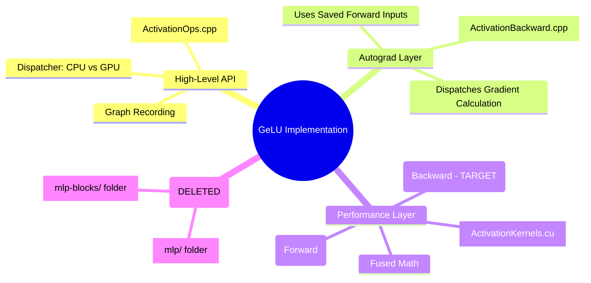

# GeLU Optimization Deep Dive: Architecture, Fusion, and Legacy Cleanup

This document provides a comprehensive overview of the GeLU (Gaussian Error Linear Unit) implementation within the `master_gau` library. It covers the mathematical foundations, the current optimization state, the recent removal of legacy MLP code, and the roadmap for the backward pass optimization.

---

## 🚀 TL;DR
- **Formula**: Industry-standard **Tanh Approximation**.
- **Optimization**: The **Forward Pass** is highly optimized (Fused and Vectorized with `float4`).
- **Optimization Goal**: The **Backward Pass** is currently a scalar loop and is our primary target for vectorization.
- **Fusion**: **Bias + GeLU** is implemented as a single-pass kernel to save memory bandwidth.
- **Cleanup**: Legacy `mlp/` and `mlp-blocks/` directories have been deleted as they were redundant remnants of an early development phase.

---

## 🧩 Core Architecture & Data Flow

The GeLU implementation is split across three main layers: the high-level dispatcher, the autograd integration, and the low-level CUDA kernels.

---

## 📈 Mathematical Foundation

We use the **Tanh Approximation**, which is common in models like GPT-2 and BERT. It offers an excellent balance between precision and computational cost on modern GPUs.

$$GeLU(x) \approx 0.5x \left( 1 + \tanh\left( \sqrt{\frac{2}{\pi}} (x + 0.044715x^3) \right) \right)$$

### 🛠️ Why Tanh?
- **Stability**: Much higher precision than the Sigmoid/Swish approximation.
- **Hardware Acceleration**: Modern GPUs can use `tanh.approx.f32` (PTX) for near-instant execution.
- **Backward Cost**: While the derivative is more complex than a standard ReLU, fusion ensures it remains memory-bound rather than compute-bound.

---

## ⚡ Fusion: Doing More in One Pass

In GPU computing, **Memory Bandwidth** is usually the bottleneck, not the raw FLOPs. We use **Fusion** to minimize trips to the RAM.

### 1. Operation Fusion (GeLU Math)
Instead of launching separate kernels for $x^3$, then the addition, then the tanh, we perform all 6 mathematical steps in one single CUDA kernel.
- **Status**: **Fully Fused** (GPU side).

### 2. Layer Fusion (Bias + GeLU)
We merge the **Bias Addition** and the **Activation Function** into a single operation.

> [!TIP]
> **Performance Impact**: Without fusion, the GPU writes the results of `x + bias` to RAM and then reads them back for `GeLU`. Fusion keeps the intermediate data in registers, saving **50% of the memory bandwidth** for this layer.

---

## 🧼 The "Legacy" Cleanup: MLP Block Removal

During recent analysis, we discovered that the `mlp/` (headers) and `mlp-blocks/` (source) directories contained early implementations written by the original team lead. 

### Why they were removed:
1.  **Redundancy**: The current training flow (e.g., `gpt2_attn_fixed.cpp`) uses the modern Autograd system (`autograd::gelu`), which is implemented in `ActivationOps.cpp`.
2.  **Inconsistency**: Some legacy implementations (like the one in `activation.cpp`) contained mathematical bugs, such as using a minus sign instead of a plus in the Tanh formula.
3.  **Modern Architecture**: The new `nn/` and `autograd/` namespaces provide a more unified and scalable way to build models.

> [!IMPORTANT]
> All `#include "mlp/activation.h"` statements have been removed from the codebase. The build system automatically handles the removal due to the `find` discovery logic in the `Makefile`.

---

## 🔍 Backlogs & Loopholes

While the **Forward Pass** is state-of-the-art, here is what we noticed during the deep dive:

| Feature | Forward Pass | Backward Pass |
| :--- | :--- | :--- |
| **Fusion** | ✅ Yes | ✅ Yes |
| **Vectorization** | ✅ Yes (`float4`) | ❌ No (Scalar Loop) |
| **CPU Implementation** | ❌ No (Not Fused) | ❌ No (Not Fused) |

### The "Loophole": Scalar Backward
The backward kernel currently processes one element at a time per thread. This is a "loophole" in our performance strategy because the GPU's memory controllers operate most efficiently when threads access contiguous chunks of memory (vectorized loads).

---

## 🗺️ Roadmap: Vectorizing the Backward Pass

Our next major task is to bring the `float4` and `half2` vectorization strategies to the **Backward Kernel**.

1.  **Implementation**: Cast weights as `float4` inside `fused_gelu_backward_kernel`.
2.  **Specialization**: Ensure `float16` and `bfloat16` paths also utilize vectorized loads.
3.  **Bias Reduction**: Optimize the gradient calculation for Bias in the `fused_bias_gelu_backward` kernel, ensuring it doesn't become a bottleneck during the reduction phase.

---
*Document created by Antigravity in collaboration with the engineering team.*
