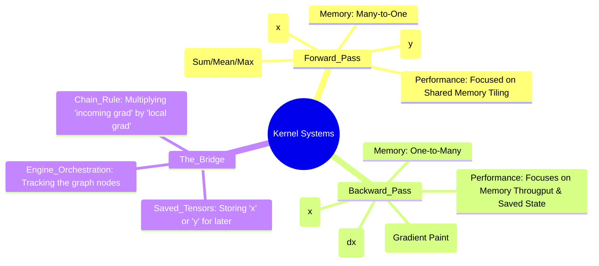
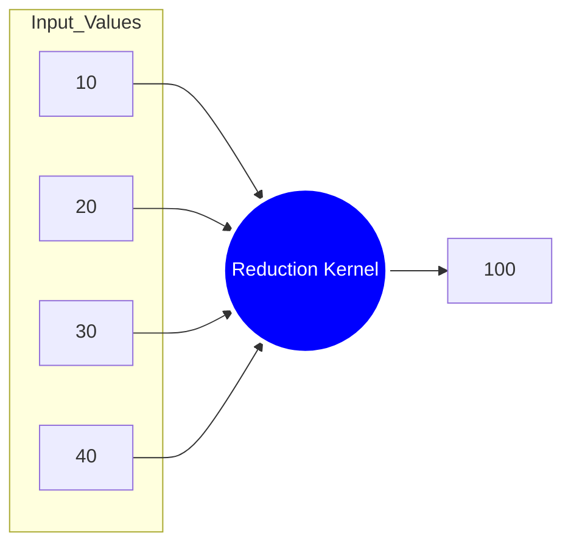
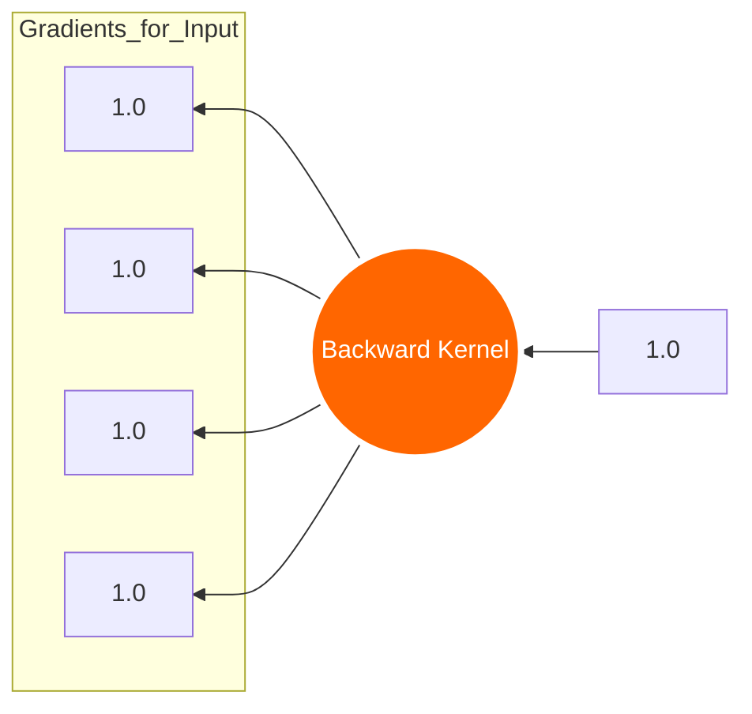

# 🚀 Analysis: Forward vs. Backward Kernels in master_gau

This document provides a detailed, "pin-to-pin" breakdown of the design principles and implementation differences between Forward and Backward kernels in your library.

---

## 💎 The 10-Second TL;DR
**Are they the same?**
> [!IMPORTANT]
> **NO.** They are mathematical and structural opposites. Forward is a **Calculative Worker**; Backward is a **Diagnostic Accountant.**

**Fundamental Difference:**
- **Forward Pass**: Answers the question: "What is the result?" ($f(x)$).
- **Backward Pass**: Answers the question: "How much did each input cause the error?" ($\frac{\partial L}{\partial x}$).

---

## 📊 Visual Mindmap: Kernel Architectures

---

## 🛠️ Case Study: "The Funnel vs. The Paintbrush"

Comparing a **Sum Reduction** operation "pin-to-pin":

### 1. Forward Kernel (The Funnel)
**Location:** `src/UnaryOps/cuda/ReductionImplGPU.cu`

*   **Data Path**: Thousands of inputs are "funneled" into one single result.
*   **Pattern**: Uses **Warp Shuffles** (`__shfl_down_sync`) to collapse values across hardware threads.

### 2. Backward Kernel (The Paintbrush)
**Location:** `src/autograd/backward/ReductionBackward.cpp`

*   **Data Path**: One incoming gradient is "painted" or **Broadcast** back to every original input.
*   **Pattern**: There is no reduction math here. Every thread Simply writes the same gradient value to its memory slot.

---

## 🧮 Why logic flips: The Matrix Case
In `src/Kernels/cuda/MatmulBackward.cu`, the logic changes completely to satisfy math:

| Pass | Mathematical Logic | Pattern |
| :--- | :--- | :--- |
| **Forward** | $C = A \cdot B$ | Standard Row-by-Column dot product. |
| **Backward (dA)** | $dA = dC \cdot B^T$ | Multiplies output gradient by **Transposed B**. |
| **Backward (dB)** | $dB = A^T \cdot dC$ | Multiplies **Transposed A** by output gradient. |

> [!TIP]
> Notice the **Transpositions** ($B^T, A^T$). The backward kernel actually has to solve a "transposed problem," which is why it uses specialized Shared Memory tiling to flip the matrix "on the fly" for speed.

---

## 🏁 Summary Table: Same vs. Different

| Feature | Forward Pass | Backward Pass | Are they the same? |
| :--- | :--- | :--- | :--- |
| **Formula** | $f(x)$ | $\text{grad} \times f'(x)$ | **Different** |
| **Memory Flow** | Read Inputs $\rightarrow$ Write Output | Read Grads + Inputs $\rightarrow$ Write Grads | **Different** |
| **Saved State** | Stateless (usually) | Needs **Saved Tensors** (x or y) | **Different** |
| **Infrastructure** | GPU Memory / Allocator | GPU Memory / Allocator | **Same** |
| **Topology** | Condensed (Merging) | Expanded (Broadcasting) | **Different** |

---
*Created for the master_gau library analysis.*
