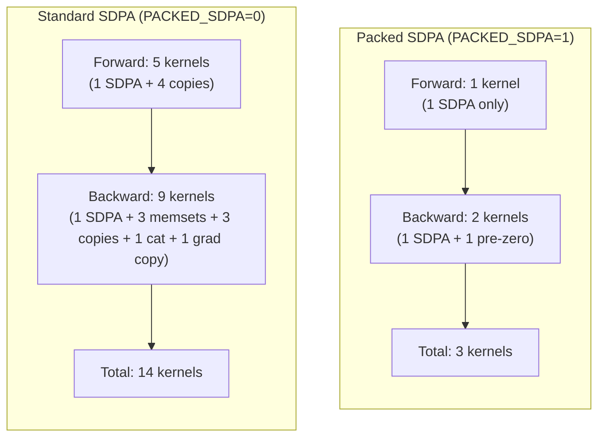

# Packed SDPA — Design, Implementation, and Usage

A complete record of the attention-copy elimination work: what existed before,
what changed, why, how to use it, and how to verify it.

---

## Table of contents

1. [The problem we set out to fix](#1-the-problem-we-set-out-to-fix)
2. [Three independent copy sources](#2-three-independent-copy-sources)
3. [Solution layers — what each fix can and cannot reach](#3-solution-layers)
4. [Previous code — what was running before this change](#4-previous-code)
5. [Smart reshape (mine) — what it does, where it falls short](#5-smart-reshape)
6. [Colleague's Packed SDPA — the layout-level fix](#6-packed-sdpa)
7. [What we implemented in this branch](#7-what-we-implemented)
8. [The dispatch system — `USE_PACKED_SDPA` env var](#8-the-dispatch-system)
9. [How to run — correct and incorrect commands](#9-how-to-run)
10. [What the nsys report should show](#10-nsys-expectations)
11. [The `skip_grad_zero` flag explained](#11-skip_grad_zero)
12. [Fairness vs Karpathy](#12-fairness)
13. [Files touched](#13-files-touched)
14. [Architecture Mindmaps — Standard SDPA Forward](#14-standard-sdpa-forward-mindmap)
15. [Architecture Mindmaps — Packed SDPA Forward](#15-packed-sdpa-forward-mindmap)
16. [Architecture Mindmaps — Standard SDPA Backward](#16-standard-sdpa-backward-mindmap)
17. [Architecture Mindmaps — Packed SDPA Backward](#17-packed-sdpa-backward-mindmap)
18. [Side-by-Side Summary & Memory Layout Visualization](#18-side-by-side-summary)

---

## 1. The problem we set out to fix

In a standard transformer attention block (Karpathy / nanoGPT / GPT-2 style),
the canonical sequence is:

```
qkv = c_attn(x)                         # [B, T, 3*C], one cuBLAS GEMM
q, k, v = split(qkv, axis=-1)           # 3 strided views of [B, T, C]
q = q.reshape(B, T, nh, hd).transpose(1, 2)   # → [B, nh, T, hd]
k = k.reshape(B, T, nh, hd).transpose(1, 2)
v = v.reshape(B, T, nh, hd).transpose(1, 2)
y = SDPA(q, k, v, is_causal=True)       # [B, nh, T, hd] contiguous
y = y.transpose(1, 2).reshape(B, T, C)  # ← merge copy here
out = c_proj(y)                         # cuBLAS GEMM
```

Every layer, every micro-step, on both forward AND backward, this incurs:

- **Forward**: 1 strided-copy at `transpose(1,2).reshape(B,T,C)` (the merge).
- **Backward**: 3 strided-copies (one per Q/K/V grad merging back to `[B,T,C]`)
  plus 1 `Tensor::cat` to recombine `dQ/dK/dV` into a packed `[B,T,3C]` for the
  `c_attn` linear backward.

For 12 layers × 32 micro × 10 steps → **15,840 `generic_strided_copy_kernel`
calls + 3,840 `cat_batched_kernel` calls per nsys run**, accounting for ~1–2%
of wall time and unnecessary HBM traffic.

---

## 2. Three independent copy sources

Around attention there are *three* categorically different copy sites, each
caused by a different consumer's requirements:

```
qkv [B,T,3C] ─reshape─→ q,k,v ─transpose─→ SDPA ─transpose─→ reshape ─→ c_proj
            (A)                     (B)              (C)
```

| Spot | Who forces the copy | What kind of fix is needed |
|---|---|---|
| (A) Reshape into `[B,T,nh,hd]` | The reshape op itself, when source isn't naturally view-eligible | A smarter reshape rule (mine) |
| (B) SDPA reads strided Q/K/V | The kernel's read pattern | Stride-aware kernel (already done by colleague earlier) |
| (C) `transpose+reshape` merge into `[B,T,C]` | `c_proj` (the next cuBLAS GEMM), which demands a single leading dimension | Layout choice — kernel must write the right shape |

These are **independent**. Fixing one does not address the others.

---

## 3. Solution layers — what each fix can and cannot reach

| Approach | Fixes | Cannot fix |
|---|---|---|
| **Stride-aware attention kernel** | (B) — SDPA reads non-contig Q/K/V via stride params | Anything outside the kernel's I/O |
| **Smart reshape** (general view-eligibility detection in `compute_view_stride`) | (A) — reshape returns metadata-only view when stride layout permits | (C) — when merging non-memory-adjacent dims, no stride-tuple can express the merge → `.contiguous()` is mandatory |
| **Packed SDPA** | (C) plus everything in (A)/(B) — by changing the kernel's output layout so the merge does not exist | Non-attention reshapes elsewhere in the model |

These are **complementary, not alternatives**. Keep all three.

---

## 4. Previous code — what was running before this change

The `Attention::forward` block in `gpt2_attn_navin.cpp` (the only path):

```cpp
Tensor qkv = c_attn.forward(h);                                 // [B, T, 3C] contig

std::vector<Tensor> inp = qkv.make_shards_inplace_axis(3, 2);  // 3 strided views
Tensor q = inp[0], k = inp[1], v = inp[2];                      // each [B,T,C], strideT=3C

q = autograd::transpose(autograd::reshape(q, {B,T,nh,hd}), 1, 2);
k = autograd::transpose(autograd::reshape(k, {B,T,nh,hd}), 1, 2);
v = autograd::transpose(autograd::reshape(v, {B,T,nh,hd}), 1, 2);

Tensor attn_out = autograd::scaled_dot_product_attention(
    q, k, v, /*is_causal=*/true, 0.0f, autograd::SDPBackend::MemoryEfficient);

Tensor merged = autograd::reshape(
                    autograd::transpose(attn_out, 1, 2),
                    {B, T, C});                                  // ← (C) copy here

Tensor proj = c_proj.forward(merged);
```

What survives in this path even after my smart-reshape fix:

- (A) reshape `q/k/v → [B,T,nh,hd]`: VIEW-only after smart-reshape ✓
- (B) SDPA reads strided Q/K/V: no `.contiguous()` ✓
- (C) `transpose(1,2).reshape({B,T,C})` merge: **forced copy**, smart-reshape
  cannot help (dims `nh` and `hd` are non-memory-adjacent after the transpose)
- Backward QKV reshape: same merge problem mirrored — **forced copy**
- Backward shard-cat: `Make_shards_inplace_axis_Backward` calls `Tensor::cat`
  to recombine `dQ/dK/dV` into one `[B,T,3C]` tensor — **forced copy** (the
  `cat_batched_kernel`)

Net cost per layer per micro: 4 strided copies + 1 cat. Across a 10-step nsys
run: **15,840 `generic_strided_copy` + 3,840 `cat_batched` calls.**

---

## 5. Smart reshape (mine)

`ViewUtils::compute_view_stride` mirrors PyTorch's
`at::detail::computeStride_impl` (TensorUtils.cpp:327). For a candidate
reshape, it walks old dims back-to-front, tracks memory-contiguous chunks,
and drains view dims into each chunk. If all view dims fit cleanly, the
reshape is metadata-only (returns a non-empty `Stride`); otherwise it returns
empty (signal: caller must `.contiguous()`).

**Catches**: cases like the QKV split where the inner 768-element row of the
`[B,T,C]` shard is dense within the larger `[B,T,3C]` allocation, even though
the outer row stride is `3*C`. Splitting that 768 into `[12, 64]` is then a
free view. **Eliminated 12,960 `strided_inner_vec_copy_kernel` calls** in the
forward QKV path.

**Cannot catch**: site (C). After `transpose(1,2)`, the `[B,T,nh,hd]` tensor
has strides like `[nh*T*hd, hd, T*hd, 1]`. Merging the trailing `[nh, hd]`
into a single `C` dim requires that `stride[nh] == hd * stride[hd]`, i.e.,
`T*hd == hd * 1 = hd`. False unless T=1. So a real `cudaMemcpy`-based copy is
mandatory, regardless of any reshape rule. PyTorch hits the same dead-end and
falls back to `.contiguous()` here.

---

## 6. Colleague's Packed SDPA — the layout-level fix

Instead of trying to make the merge a free view, the trick is to **never
produce the layout that needs merging in the first place**. The kernel reads
Q/K/V via strided pointer arithmetic into a single packed buffer and writes
its output in the layout `c_proj` already wants.

### Forward — `sdpa_memory_efficient_packed`

```
qkv [B,T,3C] (contiguous, from c_attn cuBLAS output)
  │
  │  Three strided pointers into the SAME buffer:
  │    Q_ptr = qkv_ptr + 0
  │    K_ptr = qkv_ptr + C
  │    V_ptr = qkv_ptr + 2C
  │  Common strides for the [B, nh, T, hd] view:
  │    strideB = T * 3C
  │    strideM = 3C       (Q,K,V interleaved on the T axis)
  │    strideH = hd
  │    last (hd) stride = 1
  │
  │  No shard. No reshape. No transpose. No copy.
  ▼
mem_efficient_attn_forward_tc(...)         ← stride-aware kernel
  │
  │  Output written DIRECTLY as packed [B,T,C] contig
  │  (heads packed inside each token).
  ▼
output [B,T,C] contig                       ← already what c_proj wants
  ▼
c_proj.forward(output)                      ← straight into cuBLAS, no merge
```

### Backward — `PackedSDPABackward::apply`

```
grad_output [B,T,C] contig (from c_proj backward)
  │
  │  Allocate ONE buffer: dqkv = Tensor::zeros([B, T, 3C])
  │  Three strided pointers:
  │    dQ_ptr = dqkv_ptr + 0
  │    dK_ptr = dqkv_ptr + C
  │    dV_ptr = dqkv_ptr + 2C
  │  All with strideB = T*3C, strideM = 3C, strideH = hd.
  │
  │  Call mem_efficient_attn_backward(..., skip_grad_zero=true)
  │  (kernel must NOT memset dQ/dK/dV — would corrupt interleaved buffer)
  ▼
return {dqkv}        ← one packed [B,T,3C] tensor, ready for c_attn backward
                       NO Tensor::cat needed → cat_batched_kernel disappears
```

### What this kills

| Counter | Unfused path | Packed path |
|---|---|---|
| `cat_batched_kernel` | 3,840 | **0** |
| `generic_strided_copy_kernel` (attention) | 15,840 | **0** |
| `strided_inner_vec_copy_kernel` (QKV reshape) | 0 (already gone via smart reshape) | 0 |

Compute-wise: **same FLOPs, same matmuls, same softmax**. Only memory plumbing
changes. Strides cost zero at runtime — they're just integer multiplies in
addressing.

---

## 7. What we implemented in this branch

Eight surgical edits, all backward-compatible (defaults preserve every existing
caller bit-identically):

| # | File | What changed |
|---|------|--------------|
| 1 | `include/ops/helpers/AttentionKernels.h` | Added `bool skip_grad_zero=false` to `mem_efficient_attn_backward` |
| 2 | `src/Kernels/cuda/attention/AttentionBackward.cu` | Param threaded through; both internal memsets (exp7 dQ, exp11 dK/dV) gated by `if (!skip_grad_zero)`; sm89 dispatch forwards the flag |
| 3 | `src/Kernels/cuda/attention/arch/AttentionBackward_sm89.cu` | Same param + gate on exp12 dK/dV memsets |
| 4 | `include/autograd/backward/AttentionBackward.h` | Added `PackedSDPABackward` class |
| 5 | `src/autograd/backward/AttentionBackward.cpp` | Implemented `PackedSDPABackward::apply` (allocates zeroed `dqkv`, sets strided ptrs, calls kernel with `skip_grad_zero=true`, returns single packed dqkv) |
| 6 | `include/autograd/operations/AttentionOps.h` | Declared `scaled_dot_product_attention_packed` |
| 7 | `src/autograd/operations/AttentionOps.cpp` | Added static `sdpa_memory_efficient_packed` (zero shard/reshape/transpose; calls `mem_efficient_attn_forward_tc` with strided pointers; allocates packed `[B,T,C]` output; wires `PackedSDPABackward`) plus public `scaled_dot_product_attention_packed` dispatch |
| 8 | `gpt2_attn_navin.cpp` | Added `<cstdlib>` and the 2-path env-gated branch in `Attention::forward` |

There is **no third path**. The `USE_QKV_RESHAPE_FIRST` middle path that
appeared in the colleague's `gpt2_fmha_ddp.cpp` was deliberately not ported —
it is a half-measure that doesn't belong.

---

## 8. The dispatch system — `USE_PACKED_SDPA` env var

The branching code in `gpt2_attn_navin.cpp`:

```cpp
static const bool kUsePackedSdpa = []() {
    const char* e = std::getenv("USE_PACKED_SDPA");
    return e && e[0] == '1';
}();

Tensor merged;
if (kUsePackedSdpa) {
    merged = autograd::scaled_dot_product_attention_packed(
        qkv, n_heads_, /*is_causal=*/true, /*dropout_p=*/0.0f,
        autograd::SDPBackend::MemoryEfficient);
} else {
    /* original shard → reshape → transpose → SDPA → transpose → reshape */
}
```

The `static` lambda runs **once per process** at the first call to
`Attention::forward`, caches the result, and reuses it for every subsequent
attention call (12 layers × 32 micro × 10 steps × ... uses the cached bool —
no per-call `getenv`).

### Default behavior table

| Env var state | `getenv` returns | Branch taken | Why |
|---|---|---|---|
| **not set** | `nullptr` | **unfused** | `nullptr && ...` short-circuits to false |
| `USE_PACKED_SDPA=` (empty) | `""` | unfused | `e[0]` is `'\0'`, not `'1'` |
| `USE_PACKED_SDPA=0` | `"0"` | unfused | `e[0]` is `'0'` |
| `USE_PACKED_SDPA=1` | `"1"` | **packed** | matches |
| `USE_PACKED_SDPA=true` | `"true"` | unfused | `e[0]` is `'t'` |
| `USE_PACKED_SDPA=yes` | `"yes"` | unfused | `e[0]` is `'y'` |
| `USE_PACKED_SDPA=01` | `"01"` | unfused | `e[0]` is `'0'` |
| `USE_PACKED_SDPA=1abc` | `"1abc"` | packed | `e[0]` is `'1'` (only first char checked) |

**Design choice — fail-closed default.** If you forget to set the env var, you
get the well-tested unfused path (no behavior change vs the old code). Only the
literal `1` activates the new path. Reverting to the safe path requires only
unsetting the variable.

---

## 9. How to run — correct and incorrect commands

In bash, `VAR=val command args` sets `VAR` only in the environment of
`command`. Anything **after** the executable name is `argv`, not env. This
distinction has bitten this codebase already. Get it right.

### Correct

```bash
# Inline env var, prefixed before the command that needs it:
CUDA_VISIBLE_DEVICES=6 USE_PACKED_SDPA=1 nsys profile --stats=true ./snippet_runner

# Or export once, then run normally:
export USE_PACKED_SDPA=1
echo "$USE_PACKED_SDPA"          # sanity check — must print "1"
CUDA_VISIBLE_DEVICES=6 nsys profile --stats=true ./snippet_runner

# For `make`: pass as env, not as a make variable, so it propagates to the child:
USE_PACKED_SDPA=1 make run-snippet FILE=gpt2_attn_navin.cpp WITH_BLUBLAS=1
```

### Incorrect — these all silently run the unfused path

```bash
# WRONG #1: trailing argument to the executable.
# `USE_PACKED_SDPA=1` ends up in argv[1], which the program ignores.
nsys profile --stats=true ./snippet_runner USE_PACKED_SDPA=1

# WRONG #2: argument to nsys, before the executable.
# nsys treats it as an option and either errors or ignores; either way,
# `getenv` in the child returns nullptr.
nsys profile USE_PACKED_SDPA=1 --stats=true ./snippet_runner

# WRONG #3: make variable. By default, make-line variables become env vars
# in the make process, but make's recipes do not auto-export them to child
# processes unless the recipe explicitly references them or `.EXPORT_ALL_VARIABLES`
# is set. Most recipes don't. Result: the binary launched by `make` does not see it.
make run-snippet FILE=gpt2_attn_navin.cpp USE_PACKED_SDPA=1

# WRONG #4: setting on its own line, no effect on the next command.
USE_PACKED_SDPA=1
./snippet_runner   # the assignment above only set it for that empty command

# WRONG #5: lowercase or wrong name.
use_packed_sdpa=1 ./snippet_runner   # env var names are case-sensitive
```

### Sanity-check pattern (always do this on first run)

Add a one-line print at the top of `Attention::forward` in
`gpt2_attn_navin.cpp`:

```cpp
static bool kPrinted = []() {
    std::cout << "[ATTN] USE_PACKED_SDPA="
              << (kUsePackedSdpa ? "1 (packed)" : "0 (unfused)") << "\n";
    return true;
}();
```

It fires once per process. If it says `1 (packed)` you're good; if it says
`0 (unfused)` your env var didn't reach the binary.

---

## 10. nsys expectations

After a clean rebuild and a correctly-launched run with `USE_PACKED_SDPA=1`:

| Counter | Unfused (=0) | Packed (=1) |
|---|---|---|
| `cat_batched_kernel` | ~3,840 | **0** |
| `generic_strided_copy_kernel` | ~15,840 | small residue (logits flatten in loss, weight-tied transpose backward, optimizer reshapes — NOT attention) |
| `strided_inner_vec_copy_kernel` | 0 (already eliminated by smart reshape) | 0 |
| `mem_efficient_bwd_unified_kernel_exp12` | 3,840 | 3,840 (unchanged — same kernel, same compute) |
| `fused_attn_forward_kernel_tc_sm89` | ~4,320 | ~3,840 (fewer, since per-micro forward is one packed call instead of one sharded call — depending on dispatch tile shape) |
| Loss curve at step 0..9 | reference | should match within fp noise (< 1e-4) |
| Wall time per step | reference | similar or slightly faster (kernel time flat; copies eliminated) |

If the loss curve diverges materially between `=0` and `=1`, something is
wrong in the packed path (most likely the memset gating — check that all three
paths in `AttentionBackward.cu` and `AttentionBackward_sm89.cu` correctly skip
when `skip_grad_zero=true`).

---

## 11. The `skip_grad_zero` flag explained

The backward attention kernel uses `atomicAdd` to accumulate `dQ/dK/dV`. For
`atomicAdd(addr, x)` to be correct, `*addr` must already be zero — otherwise
the result is `garbage + x`, not `0 + x`. The kernel therefore runs three
internal `cudaMemsetAsync` calls before launching the compute kernel:

```cpp
// AttentionBackward.cu — exp7 path (HD not divisible by 16):
cudaMemsetAsync(params.dQ, 0, BH * T * HD * sizeof(float));

// AttentionBackward.cu — exp11 path (TF32, HD%16==0):
cudaMemsetAsync(params.dK, 0, BH * T * HD * sizeof(float));
cudaMemsetAsync(params.dV, 0, BH * T * HD * sizeof(float));

// AttentionBackward_sm89.cu — exp12 path (Ada, BM=32):
cudaMemsetAsync(params.dK, 0, BH * T * HD * sizeof(float));
cudaMemsetAsync(params.dV, 0, BH * T * HD * sizeof(float));
```

Each memset assumes the destination is **a single contiguous `BH*T*HD` block**.
For the unfused path, `dQ/dK/dV` are three separate tensors — that assumption
holds. For packed mode, `dQ/dK/dV` are interleaved pointer offsets into a single
`dqkv` buffer:

```
dqkv = [dQ_t0 | dK_t0 | dV_t0 | dQ_t1 | dK_t1 | dV_t1 | ...]
        ↑       ↑       ↑
   params.dQ params.dK params.dV
```

A naïve memset of `BH*T*HD` bytes at `params.dQ` would zero a flat span that
overlaps the dK/dV interleaved positions, corrupting them. So in packed mode
we instead pre-zero the **entire** `dqkv` with `Tensor::zeros([B,T,3C])` once
externally and tell the kernel to skip its internal memsets.

`skip_grad_zero` is a `bool` parameter, default `false`:

```cpp
void mem_efficient_attn_backward(... bool is_causal,
                                 bool skip_grad_zero = false);
```

| Caller | Passes | Effect |
|---|---|---|
| Existing `MemEfficientAttentionBackward::apply` (unfused) | nothing → defaults to `false` | Internal memsets fire as before. **Bit-identical behavior.** |
| New `PackedSDPABackward::apply` | `skip_grad_zero=true` | Internal memsets skipped. Caller has already zeroed the whole `dqkv` buffer in one shot. |

### Cost analysis

| Mode | Memset bytes | Memset calls |
|---|---|---|
| exp11 / exp12 unfused | 2 × B*T*C | 2 |
| exp7 unfused (HD not %16) | 1 × B*T*C | 1 |
| Packed (any HD) | 3 × B*T*C (one external `Tensor::zeros`) | 1 |

Packed pays ~50% more memset bandwidth than exp11/exp12 (memset is ~1+ TB/s on
Ada, so the absolute cost is microseconds — negligible compared to the
attention kernel itself). In return, the entire merge-copy and shard-cat
overhead disappears.

### Side-effects on other kernels / optimizations

| Concern | Impact |
|---|---|
| Other CUDA kernels (forward, layernorm, GELU, matmul, loss) | None — only `mem_efficient_attn_backward` signature changes |
| Smart-reshape | Independent — still runs on the unfused path |
| Stride-aware attention forward | Untouched |
| Save_max/save_sum loss optimization | Untouched |
| cublasLt epilogue fusion (bias / GELU) | Untouched |
| ContiguousKernel coalescing | Untouched |
| ABI compatibility for existing callers | Preserved — default value means old callsites compile and behave unchanged |

---

## 12. Fairness vs Karpathy

Karpathy's `fullgpt.py` (line 37) explicitly calls `.contiguous()` on the
merged attention output:

```python
y = y.transpose(1, 2).contiguous().view(B, T, C)
```

He **knows** this is a mandatory copy in PyTorch's eager path. PyTorch's
`F.scaled_dot_product_attention` does not provide a packed-QKV variant — it
takes separate `q, k, v` tensors. Internally FlashAttention reads them with
strides (like our stride-aware kernel), but the merge copy after SDPA is still
there in his code.

Implementing Packed SDPA on our side is a **legitimate architectural
optimization**: same model, same math, same loss curve — smarter memory
plumbing. We are not changing the network or the training algorithm. Loss
parity with the unfused path (verifiable by running with `=0` and `=1` and
diffing the per-step losses) confirms numerical equivalence. We are simply
producing the kernel's output in the layout the next op already wants, instead
of producing it in a layout that forces a transpose+merge copy.

So: better than Karpathy at the layout level, identical to Karpathy at the
math/loss level. Fair game.

---

## 13. Files touched

```
master_gau_latest_ada_6000_sm89/
├── include/
│   ├── ops/helpers/AttentionKernels.h               (+ skip_grad_zero param)
│   ├── autograd/operations/AttentionOps.h           (+ scaled_dot_product_attention_packed)
│   └── autograd/backward/AttentionBackward.h        (+ PackedSDPABackward class)
├── src/
│   ├── Kernels/cuda/attention/
│   │   ├── AttentionBackward.cu                     (gate memsets, thread param to sm89)
│   │   └── arch/AttentionBackward_sm89.cu           (gate memsets in exp12)
│   └── autograd/
│       ├── operations/AttentionOps.cpp              (+ sdpa_memory_efficient_packed + dispatch)
│       └── backward/AttentionBackward.cpp           (+ PackedSDPABackward::apply)
└── gpt2_attn_navin.cpp                              (+ <cstdlib>, USE_PACKED_SDPA gate)
```

### Build note

Because kernel signatures changed (`skip_grad_zero` added to
`mem_efficient_attn_backward` and `mem_efficient_attn_backward_sm89_cuda`), do
a **clean rebuild** the first time:

```bash
make clean
USE_PACKED_SDPA=1 make run-snippet FILE=gpt2_attn_navin.cpp WITH_BLUBLAS=1
```

Without `make clean`, the build system may reuse stale `.o` files compiled
against the old signature → linker errors or, worse, silent ABI mismatch (one
compilation unit calls the function with the wrong number of arguments).

### Quick verification checklist

1. `[ATTN] USE_PACKED_SDPA=1 (packed)` printed once at startup.
2. Loss at step 9 matches `=0` run within < 1e-4.
3. nsys: `cat_batched_kernel` is 0 (or absent from the report).
4. nsys: `generic_strided_copy_kernel` count drops from ~15,840 to a few
   hundred (residue from non-attention paths).

---

## 14. Architecture Mindmaps — Standard SDPA Forward

Step-by-step data flow from the c_attn output through to c_proj, showing every
intermediate operation, its tensor shape, stride layout, and whether it triggers
a data copy or is metadata-only.

```
qkv [B, T, 3C]  (contiguous output from c_attn Linear / cublasLt GEMM)
    │
    ▼
make_shards_inplace_axis(3, axis=2)
    │   Splits along dim-2 (the 3C dimension).
    │   Creates 3 aliased VIEWS into the same storage:
    │     q [B, T, C]  stride={T·3C, 3C, 1}  offset=0
    │     k [B, T, C]  stride={T·3C, 3C, 1}  offset=C
    │     v [B, T, C]  stride={T·3C, 3C, 1}  offset=2C
    │   No data movement — just metadata.
    ▼
reshape(q, [B, T, nh, hd])
    │   Smart reshape (compute_view_stride) detects that splitting the
    │   innermost contiguous dim C=768 into nh×hd = 12×64 is view-eligible
    │   (stride[-1]=1, and 12×64=768 matches dim size).
    │   Result: VIEW with strides {T·3C, 3C, 64, 1}  ✓ NO COPY
    ▼
transpose(1, 2)
    │   Swaps dims 1 and 2:  [B, T, nh, hd] → [B, nh, T, hd]
    │   New strides: {T·3C, 64, 3C, 1}
    │   Still a VIEW — no data copy.
    ▼
.contiguous()  ← ⚠️ MANDATORY COPY #1
    │   The tensor is NOT contiguous after transpose.
    │   Stride check: {T·3C, 64, 3C, 1}
    │     dim-2 stride = 3C = 2304, but dim-2 size × dim-3 stride = T × 1 ≠ 2304
    │   Materializes a fresh [B, nh, T, hd] contiguous tensor.
    │   This is a full strided_inner_vec_copy kernel.
    │   ──── SAME for k and v (3 copies total) ────
    ▼
scaled_dot_product_attention(q_contig, k_contig, v_contig)
    │   Calls mem_efficient_attn_forward_tc with CONTIGUOUS q, k, v.
    │   Output: attn_out [B, nh, T, hd] contiguous.
    │   Also returns LSE [B, nh, T] for backward.
    ▼
attn_out.transpose(1, 2)
    │   [B, nh, T, hd] → [B, T, nh, hd]
    │   Strides become non-contiguous.
    ▼
.contiguous()  ← ⚠️ MANDATORY COPY #2
    │   Materializes [B, T, nh, hd] contiguous.
    ▼
reshape(B, T, C)
    │   [B, T, nh, hd] → [B, T, C]  (C = nh × hd = 768)
    │   Now contiguous, so this is a pure VIEW.
    ▼
y [B, T, C]  → feeds into c_proj Linear
```

### Forward Kernel Count (Standard Path)

| Kernel | Count | Purpose |
|--------|-------|---------|
| `strided_inner_vec_copy` | 3 | q, k, v `.contiguous()` after transpose |
| `mem_efficient_attn_forward_tc` | 1 | The actual SDPA computation |
| `strided_inner_vec_copy` | 1 | output `.contiguous()` after transpose |
| **Total extra copies** | **4** | |

---

## 15. Architecture Mindmaps — Packed SDPA Forward

Same starting point (c_attn output), but the entire shard → reshape → transpose →
contiguous chain is eliminated. The kernel reads directly from the packed buffer.

```
qkv [B, T, 3C]  (contiguous output from c_attn Linear / cublasLt GEMM)
    │
    │  ── NO shard, NO reshape, NO transpose, NO .contiguous() ──
    │
    │  Just compute 3 raw pointers + strides:
    │    Q_ptr = qkv.data<float>() + 0      stride: {T·3C, 3C, hd, 1}
    │    K_ptr = qkv.data<float>() + C      stride: {T·3C, 3C, hd, 1}
    │    V_ptr = qkv.data<float>() + 2·C    stride: {T·3C, 3C, hd, 1}
    │
    │  These are NOT separate tensors — they're just pointer arithmetic
    │  into the SAME qkv storage with strided access patterns.
    │  The kernel reads Q[b][h][t][d] = Q_ptr[b*T*3C + t*3C + h*hd + d]
    │
    ▼
mem_efficient_attn_forward_tc(Q_ptr, K_ptr, V_ptr, ...)
    │   Kernel already supports arbitrary strides — it reads via
    │   Q_bh[qi * q_sM + k] where q_sM = 3C (not C).
    │   The interleaved stride pattern is invisible to the kernel.
    │
    │   Output: allocated as [B, T, C] contiguous directly
    │           (strideB=T·C, strideM=C, strideH=hd)
    │   Also returns LSE [B, nh, T].
    ▼
y [B, T, C]  → feeds into c_proj Linear (ALREADY the right shape!)
```

### Forward Kernel Count (Packed Path)

| Kernel | Count | Purpose |
|--------|-------|---------|
| `mem_efficient_attn_forward_tc` | 1 | The actual SDPA computation |
| **Total extra copies** | **0** | |

> **Key insight**: Packed SDPA eliminates ALL 4 copy kernels from the forward
> pass. The kernel's stride-based indexing handles the interleaved Q/K/V layout
> natively.

---

## 16. Architecture Mindmaps — Standard SDPA Backward

The backward pass mirrors the forward, but with additional overhead from gradient
recombination (the `Tensor::cat` to reassemble dQ/dK/dV into dqkv).

```
grad_output [B, T, C]  contiguous (from c_proj backward)
    │
    ▼
Reshape backward: view as [B, T, nh, hd]   ← VIEW, no copy
    ▼
Transpose backward: .transpose(1,2)         ← VIEW, [B, nh, T, hd]
    ▼
.contiguous()  ← ⚠️ COPY for grad_output
    │
    ▼  Saved tensors from forward: q_contig, k_contig, v_contig, O_contig, LSE
    │  (these were saved AFTER .contiguous(), so already contiguous)
    │
    ▼
mem_efficient_attn_backward(grad_O, q, k, v, O, LSE, ...)
    │
    │   INTERNALLY the kernel does:
    │     cudaMemsetAsync(dQ, 0, ...)  ← zeros dQ buffer (contiguous)
    │     cudaMemsetAsync(dK, 0, ...)  ← zeros dK buffer
    │     cudaMemsetAsync(dV, 0, ...)  ← zeros dV buffer
    │   Then accumulates gradients via atomicAdd (for dQ in exp7)
    │   or direct writes (for dK, dV).
    │
    │   Output: dQ [B, nh, T, hd], dK [B, nh, T, hd], dV [B, nh, T, hd]
    │           all contiguous, all separate allocations.
    ▼
dQ.transpose(1,2).contiguous().reshape(B,T,C)  ← ⚠️ COPY (dQ merge)
dK.transpose(1,2).contiguous().reshape(B,T,C)  ← ⚠️ COPY (dK merge)
dV.transpose(1,2).contiguous().reshape(B,T,C)  ← ⚠️ COPY (dV merge)
    │
    ▼
Tensor::cat({dQ, dK, dV}, dim=2)  ← ⚠️ cat_batched_kernel
    │   Allocates dqkv [B, T, 3C] and copies all three into it.
    │   This is the backward of make_shards_inplace_axis.
    ▼
dqkv [B, T, 3C]  → feeds into c_attn Linear backward
```

### Backward Kernel Count (Standard Path)

| Kernel | Count | Purpose |
|--------|-------|---------|
| `strided_inner_vec_copy` | 1 | grad_output `.contiguous()` |
| `cudaMemsetAsync` | 3 | Internal dQ, dK, dV zeroing |
| `mem_efficient_attn_backward` | 1 | The actual backward |
| `strided_inner_vec_copy` | 3 | dQ, dK, dV transpose+contiguous |
| `cat_batched_kernel` | 1 | Recombine dQ+dK+dV → dqkv |
| **Total extra kernels** | **8** | |

---

## 17. Architecture Mindmaps — Packed SDPA Backward

The packed backward eliminates all copy, cat, and internal memset overhead by
writing gradients directly into a pre-zeroed interleaved buffer.

```
grad_output [B, T, C]  contiguous (from c_proj backward)
    │
    │  Already [B, T, C] — the forward output was packed [B, T, C].
    │  grad_O strides: {T·C, C, hd, 1}
    │  NO transpose, NO .contiguous() needed.
    │
    │  Saved tensors from forward:
    │    qkv [B, T, 3C]  (the original packed input, detached)
    │    O   [B, T, C]   (the packed output)
    │    LSE [B, nh, T]
    │
    ▼
Allocate ONE tensor: dqkv = Tensor::zeros([B, T, 3C])
    │
    │  Compute 3 strided pointers into this single buffer:
    │    dQ_ptr = dqkv.data<float>() + 0     stride: {T·3C, 3C, hd, 1}
    │    dK_ptr = dqkv.data<float>() + C     stride: {T·3C, 3C, hd, 1}
    │    dV_ptr = dqkv.data<float>() + 2·C   stride: {T·3C, 3C, hd, 1}
    │
    │  Same pointer trick as forward — dQ/dK/dV are interleaved
    │  inside dqkv, NOT separate contiguous blocks.
    │
    ▼
mem_efficient_attn_backward(..., skip_grad_zero=true)
    │
    │   skip_grad_zero=true means:
    │     ✗ NO cudaMemsetAsync(dQ, 0, ...) — we already zeroed dqkv
    │     ✗ NO cudaMemsetAsync(dK, 0, ...) — same buffer, already zero
    │     ✗ NO cudaMemsetAsync(dV, 0, ...) — same buffer, already zero
    │
    │   WHY skip? Because the kernel's internal memset assumes dQ/dK/dV
    │   are CONTIGUOUS blocks. But here they're INTERLEAVED (stride 3C
    │   between rows). A contiguous memset would corrupt neighboring
    │   gradients. We pre-zeroed the ENTIRE interleaved buffer instead.
    │
    │   The kernel writes gradients via the same stride-based indexing:
    │     dQ[b][h][t][d] = dQ_ptr[b*T*3C + t*3C + h*hd + d]
    │
    │   Output: dQ/dK/dV are written IN-PLACE into dqkv.
    ▼
dqkv [B, T, 3C]  → feeds DIRECTLY into c_attn Linear backward
    │
    │  ── NO transpose, NO .contiguous(), NO Tensor::cat ──
    │  The single dqkv buffer IS the gradient for qkv.
```

### Backward Kernel Count (Packed Path)

| Kernel | Count | Purpose |
|--------|-------|---------|
| `cudaMemsetAsync` | 1 | Pre-zero the entire dqkv buffer |
| `mem_efficient_attn_backward` | 1 | The actual backward |
| **Total extra kernels** | **1** | (just the pre-zero) |

### Why the kernel CAN'T memset internally for packed layout

```
dqkv buffer (interleaved):
┌─────────┬─────────┬─────────┐
│ dQ[t=0] │ dK[t=0] │ dV[t=0] │  ← 3C floats per token
│ dQ[t=1] │ dK[t=1] │ dV[t=1] │
│ ...     │ ...     │ ...     │
└─────────┴─────────┴─────────┘

If kernel does cudaMemsetAsync(dQ_ptr, 0, B*nh*T*hd*sizeof(float)):
  → It would zero a CONTIGUOUS block of B*nh*T*hd floats starting at dQ_ptr
  → But dQ is NOT contiguous! It has stride 3C between rows.
  → The memset would OVERWRITE dK and dV data! ✗ CORRUPTION

Solution: Pre-zero the ENTIRE dqkv buffer ONCE (all 3C×T×B floats),
then tell the kernel skip_grad_zero=true so it doesn't touch the zeroing.
```

---

## 18. Side-by-Side Summary & Memory Layout Visualization

### Total Kernel Savings Per Attention Layer (Forward + Backward)

| | Standard | Packed | Saved |
|---|---------|--------|-------|
| **Forward copies** | 4 | 0 | **4** |
| **Backward copies** | 3 | 0 | **3** |
| **Internal memsets** | 3 | 0 | **3** |
| **cat_batched** | 1 | 0 | **1** |
| **Pre-zero** | 0 | 1 | -1 |
| **SDPA kernels** | 2 | 2 | 0 |
| **grad_output copy** | 1 | 0 | **1** |
| **Total** | **14** | **3** | **11** |

With 12 attention layers in GPT-2, packed SDPA eliminates **132 kernels per
training step** (11 × 12). That's 132 fewer kernel launches, 132 fewer memory
passes, and significant VRAM bandwidth savings.

### Mermaid Summary



### Memory Layout Visualization

#### Standard Path — Memory After Shard + Reshape + Transpose + Contiguous

```
Original qkv storage (shared by q, k, v views):
┌────────────────────────────────────────────────────────────┐
│ Q₀₀₀...Q₀₀₇₆₇ │ K₀₀₀...K₀₀₇₆₇ │ V₀₀₀...V₀₀₇₆₇ │  ← token 0
│ Q₀₁₀...Q₀₁₇₆₇ │ K₀₁₀...K₀₁₇₆₇ │ V₀₁₀...V₀₁₇₆₇ │  ← token 1
│ ...                                                       │
└────────────────────────────────────────────────────────────┘
  stride = 3C between tokens (interleaved Q/K/V)

After .contiguous() — THREE separate allocations:
┌──────────────────────┐  ┌──────────────────────┐  ┌──────────────────────┐
│ Q: [B, nh, T, hd]   │  │ K: [B, nh, T, hd]   │  │ V: [B, nh, T, hd]   │
│ contiguous, stride=C │  │ contiguous, stride=C │  │ contiguous, stride=C │
└──────────────────────┘  └──────────────────────┘  └──────────────────────┘
  ↑ 3 full copies of data!
```

#### Packed Path — Memory (NO extra allocations)

```
Same qkv storage — kernel reads DIRECTLY with stride=3C:
┌────────────────────────────────────────────────────────────┐
│ Q₀₀₀...Q₀₀₇₆₇ │ K₀₀₀...K₀₀₇₆₇ │ V₀₀₀...V₀₀₇₆₇ │  ← token 0
│ Q₀₁₀...Q₀₁₇₆₇ │ K₀₁₀...K₀₁₇₆₇ │ V₀₁₀...V₀₁₇₆₇ │  ← token 1
│ ...                                                       │
└────────────────────────────────────────────────────────────┘
  Q_ptr──┘           K_ptr──┘           V_ptr──┘
  All 3 are just pointer offsets. Zero extra VRAM.
```
