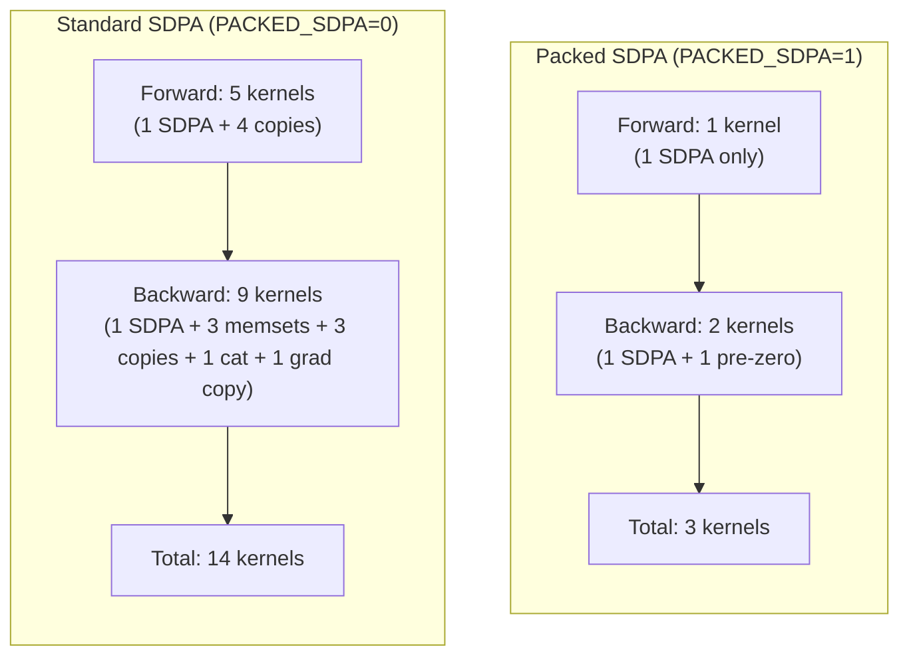

# SDPA Architecture: Standard vs Packed — Forward & Backward

> [!NOTE]
> Recreated from conversation `cb64a3a9` (May 5, 2026). These are the complete flow diagrams for how attention works in both paths.

---

## Path 1 — Standard (Unfused) SDPA Forward

```
qkv [B, T, 3C]  (contiguous output from c_attn Linear / cublasLt GEMM)
    │
    ▼
make_shards_inplace_axis(3, axis=2)
    │   Splits along dim-2 (the 3C dimension).
    │   Creates 3 aliased VIEWS into the same storage:
    │     q [B, T, C]  stride={T·3C, 3C, 1}  offset=0
    │     k [B, T, C]  stride={T·3C, 3C, 1}  offset=C
    │     v [B, T, C]  stride={T·3C, 3C, 1}  offset=2C
    │   No data movement — just metadata.
    ▼
reshape(q, [B, T, nh, hd])
    │   Smart reshape (compute_view_stride) detects that splitting the
    │   innermost contiguous dim C=768 into nh×hd = 12×64 is view-eligible
    │   (stride[-1]=1, and 12×64=768 matches dim size).
    │   Result: VIEW with strides {T·3C, 3C, 64, 1}  ✓ NO COPY
    ▼
transpose(1, 2)
    │   Swaps dims 1 and 2:  [B, T, nh, hd] → [B, nh, T, hd]
    │   New strides: {T·3C, 64, 3C, 1}
    │   Still a VIEW — no data copy.
    ▼
.contiguous()  ← ⚠️ MANDATORY COPY #1
    │   The tensor is NOT contiguous after transpose.
    │   Stride check: {T·3C, 64, 3C, 1}
    │     dim-2 stride = 3C = 2304, but dim-2 size × dim-3 stride = T × 1 ≠ 2304
    │   Materializes a fresh [B, nh, T, hd] contiguous tensor.
    │   This is a full strided_inner_vec_copy kernel.
    │   ──── SAME for k and v (3 copies total) ────
    ▼
scaled_dot_product_attention(q_contig, k_contig, v_contig)
    │   Calls mem_efficient_attn_forward_tc with CONTIGUOUS q, k, v.
    │   Output: attn_out [B, nh, T, hd] contiguous.
    │   Also returns LSE [B, nh, T] for backward.
    ▼
attn_out.transpose(1, 2)
    │   [B, nh, T, hd] → [B, T, nh, hd]
    │   Strides: {nh·T·hd, hd, T·hd, 1} → {nh·T·hd, T·hd, hd, 1}... wait
    │   Actually swaps to non-contiguous layout.
    ▼
.contiguous()  ← ⚠️ MANDATORY COPY #2
    │   Materializes [B, T, nh, hd] contiguous.
    ▼
reshape(B, T, C)
    │   [B, T, nh, hd] → [B, T, C]  (C = nh × hd = 768)
    │   Now contiguous, so this is a pure VIEW.
    ▼
y [B, T, C]  → feeds into c_proj Linear
```

### Forward Kernel Count (Standard Path)
| Kernel | Count | Purpose |
|--------|-------|---------|
| `strided_inner_vec_copy` | 3 | q, k, v `.contiguous()` after transpose |
| `mem_efficient_attn_forward_tc` | 1 | The actual SDPA computation |
| `strided_inner_vec_copy` | 1 | output `.contiguous()` after transpose |
| **Total extra copies** | **4** | |

---

## Path 2 — Packed SDPA Forward

```
qkv [B, T, 3C]  (contiguous output from c_attn Linear / cublasLt GEMM)
    │
    │  ── NO shard, NO reshape, NO transpose, NO .contiguous() ──
    │
    │  Just compute 3 raw pointers + strides:
    │    Q_ptr = qkv.data<float>() + 0      stride: {T·3C, 3C, hd, 1}
    │    K_ptr = qkv.data<float>() + C      stride: {T·3C, 3C, hd, 1}
    │    V_ptr = qkv.data<float>() + 2·C    stride: {T·3C, 3C, hd, 1}
    │
    │  These are NOT separate tensors — they're just pointer arithmetic
    │  into the SAME qkv storage with strided access patterns.
    │  The kernel reads Q[b][h][t][d] = Q_ptr[b*T*3C + t*3C + h*hd + d]
    │
    ▼
mem_efficient_attn_forward_tc(Q_ptr, K_ptr, V_ptr, ...)
    │   Kernel already supports arbitrary strides — it reads via
    │   Q_bh[qi * q_sM + k] where q_sM = 3C (not C).
    │   The interleaved stride pattern is invisible to the kernel.
    │
    │   Output: allocated as [B, T, C] contiguous directly
    │           (strideB=T·C, strideM=C, strideH=hd)
    │   Also returns LSE [B, nh, T].
    ▼
y [B, T, C]  → feeds into c_proj Linear (ALREADY the right shape!)
```

### Forward Kernel Count (Packed Path)
| Kernel | Count | Purpose |
|--------|-------|---------|
| `mem_efficient_attn_forward_tc` | 1 | The actual SDPA computation |
| **Total extra copies** | **0** | |

> [!IMPORTANT]
> **Packed SDPA eliminates ALL 4 copy kernels from the forward pass.** The kernel's stride-based indexing handles the interleaved Q/K/V layout natively.

---

## Path 1 — Standard SDPA Backward

```
grad_output [B, T, C]  contiguous (from c_proj backward)
    │
    ▼
Reshape backward: view as [B, T, nh, hd]   ← VIEW, no copy
    ▼
Transpose backward: .transpose(1,2)         ← VIEW, [B, nh, T, hd]
    ▼
.contiguous()  ← ⚠️ COPY for grad_output
    │
    ▼  Saved tensors from forward: q_contig, k_contig, v_contig, O_contig, LSE
    │  (these were saved AFTER .contiguous(), so already contiguous)
    │
    ▼
mem_efficient_attn_backward(grad_O, q, k, v, O, LSE, ...)
    │
    │   INTERNALLY the kernel does:
    │     cudaMemsetAsync(dQ, 0, ...)  ← zeros dQ buffer (contiguous)
    │     cudaMemsetAsync(dK, 0, ...)  ← zeros dK buffer  
    │     cudaMemsetAsync(dV, 0, ...)  ← zeros dV buffer
    │   Then accumulates gradients via atomicAdd (for dQ in exp7)
    │   or direct writes (for dK, dV).
    │
    │   Output: dQ [B, nh, T, hd], dK [B, nh, T, hd], dV [B, nh, T, hd]
    │           all contiguous, all separate allocations.
    ▼
dQ.transpose(1,2).contiguous().reshape(B,T,C)  ← ⚠️ COPY (dQ merge)
dK.transpose(1,2).contiguous().reshape(B,T,C)  ← ⚠️ COPY (dK merge)  
dV.transpose(1,2).contiguous().reshape(B,T,C)  ← ⚠️ COPY (dV merge)
    │
    ▼
Tensor::cat({dQ, dK, dV}, dim=2)  ← ⚠️ cat_batched_kernel
    │   Allocates dqkv [B, T, 3C] and copies all three into it.
    │   This is the backward of make_shards_inplace_axis.
    ▼
dqkv [B, T, 3C]  → feeds into c_attn Linear backward
```

### Backward Kernel Count (Standard Path)
| Kernel | Count | Purpose |
|--------|-------|---------|
| `strided_inner_vec_copy` | 1 | grad_output `.contiguous()` |
| `cudaMemsetAsync` | 3 | Internal dQ, dK, dV zeroing |
| `mem_efficient_attn_backward` | 1 | The actual backward |
| `strided_inner_vec_copy` | 3 | dQ, dK, dV transpose+contiguous |
| `cat_batched_kernel` | 1 | Recombine dQ+dK+dV → dqkv |
| **Total extra kernels** | **8** | |

---

## Path 2 — Packed SDPA Backward

```
grad_output [B, T, C]  contiguous (from c_proj backward)
    │
    │  Already [B, T, C] — the forward output was packed [B, T, C].
    │  grad_O strides: {T·C, C, hd, 1}
    │  NO transpose, NO .contiguous() needed.
    │
    │  Saved tensors from forward:
    │    qkv [B, T, 3C]  (the original packed input, detached)
    │    O   [B, T, C]   (the packed output)
    │    LSE [B, nh, T]
    │
    ▼
Allocate ONE tensor: dqkv = Tensor::zeros([B, T, 3C])
    │
    │  Compute 3 strided pointers into this single buffer:
    │    dQ_ptr = dqkv.data<float>() + 0     stride: {T·3C, 3C, hd, 1}
    │    dK_ptr = dqkv.data<float>() + C     stride: {T·3C, 3C, hd, 1}
    │    dV_ptr = dqkv.data<float>() + 2·C   stride: {T·3C, 3C, hd, 1}
    │
    │  Same pointer trick as forward — dQ/dK/dV are interleaved
    │  inside dqkv, NOT separate contiguous blocks.
    │
    ▼
mem_efficient_attn_backward(..., skip_grad_zero=true)
    │
    │   skip_grad_zero=true means:
    │     ✗ NO cudaMemsetAsync(dQ, 0, ...) — we already zeroed dqkv
    │     ✗ NO cudaMemsetAsync(dK, 0, ...) — same buffer, already zero  
    │     ✗ NO cudaMemsetAsync(dV, 0, ...) — same buffer, already zero
    │
    │   WHY skip? Because the kernel's internal memset assumes dQ/dK/dV
    │   are CONTIGUOUS blocks. But here they're INTERLEAVED (stride 3C
    │   between rows). A contiguous memset would corrupt neighboring
    │   gradients. We pre-zeroed the ENTIRE interleaved buffer instead.
    │
    │   The kernel writes gradients via the same stride-based indexing:
    │     dQ[b][h][t][d] = dQ_ptr[b*T*3C + t*3C + h*hd + d]
    │
    │   Output: dQ/dK/dV are written IN-PLACE into dqkv.
    ▼
dqkv [B, T, 3C]  → feeds DIRECTLY into c_attn Linear backward
    │
    │  ── NO transpose, NO .contiguous(), NO Tensor::cat ──
    │  The single dqkv buffer IS the gradient for qkv.
```

### Backward Kernel Count (Packed Path)
| Kernel | Count | Purpose |
|--------|-------|---------|
| `cudaMemsetAsync` | 1 | Pre-zero the entire dqkv buffer |
| `mem_efficient_attn_backward` | 1 | The actual backward |
| **Total extra kernels** | **1** | (just the pre-zero) |

---

## Side-by-Side Comparison



## Total Kernel Savings Per Attention Layer

| | Standard | Packed | Saved |
|---|---------|--------|-------|
| **Forward copies** | 4 | 0 | **4** |
| **Backward copies** | 3 | 0 | **3** |
| **Internal memsets** | 3 | 0 | **3** |
| **cat_batched** | 1 | 0 | **1** |
| **Pre-zero** | 0 | 1 | -1 |
| **SDPA kernels** | 2 | 2 | 0 |
| **grad_output copy** | 1 | 0 | **1** |
| **Total** | **14** | **3** | **11** |

> [!TIP]
> With 12 attention layers in GPT-2, packed SDPA eliminates **132 kernels per training step** (11 × 12). That's 132 fewer kernel launches, 132 fewer memory passes, and significant VRAM bandwidth savings.

---

## Memory Layout Visualization

### Standard Path — Memory After Shard + Reshape + Transpose + Contiguous

```
Original qkv storage (shared by q, k, v views):
┌────────────────────────────────────────────────────────────┐
│ Q₀₀₀...Q₀₀₇₆₇ │ K₀₀₀...K₀₀₇₆₇ │ V₀₀₀...V₀₀₇₆₇ │  ← token 0
│ Q₀₁₀...Q₀₁₇₆₇ │ K₀₁₀...K₀₁₇₆₇ │ V₀₁₀...V₀₁₇₆₇ │  ← token 1
│ ...                                                       │
└────────────────────────────────────────────────────────────┘
  stride = 3C between tokens (interleaved Q/K/V)

After .contiguous() — THREE separate allocations:
┌──────────────────────┐  ┌──────────────────────┐  ┌──────────────────────┐
│ Q: [B, nh, T, hd]   │  │ K: [B, nh, T, hd]   │  │ V: [B, nh, T, hd]   │
│ contiguous, stride=C │  │ contiguous, stride=C │  │ contiguous, stride=C │
└──────────────────────┘  └──────────────────────┘  └──────────────────────┘
  ↑ 3 full copies of data!
```

### Packed Path — Memory (NO extra allocations)

```
Same qkv storage — kernel reads DIRECTLY with stride=3C:
┌────────────────────────────────────────────────────────────┐
│ Q₀₀₀...Q₀₀₇₆₇ │ K₀₀₀...K₀₀₇₆₇ │ V₀₀₀...V₀₀₇₆₇ │  ← token 0
│ Q₀₁₀...Q₀₁₇₆₇ │ K₀₁₀...K₀₁₇₆₇ │ V₀₁₀...V₀₁₇₆₇ │  ← token 1
│ ...                                                       │
└────────────────────────────────────────────────────────────┘
  Q_ptr──┘           K_ptr──┘           V_ptr──┘
  All 3 are just pointer offsets. Zero extra VRAM.
```

---

## The Critical `skip_grad_zero` Insight

```
Why the kernel CAN'T memset internally for packed layout:

dqkv buffer (interleaved):
┌─────────┬─────────┬─────────┐
│ dQ[t=0] │ dK[t=0] │ dV[t=0] │  ← 3C floats per token
│ dQ[t=1] │ dK[t=1] │ dV[t=1] │
│ ...     │ ...     │ ...     │
└─────────┴─────────┴─────────┘

If kernel does cudaMemsetAsync(dQ_ptr, 0, B*nh*T*hd*sizeof(float)):
  → It would zero a CONTIGUOUS block of B*nh*T*hd floats starting at dQ_ptr
  → But dQ is NOT contiguous! It has stride 3C between rows.
  → The memset would OVERWRITE dK and dV data! ✗ CORRUPTION

Solution: Pre-zero the ENTIRE dqkv buffer ONCE (all 3C×T×B floats),
then tell the kernel skip_grad_zero=true so it doesn't touch the zeroing.
```
