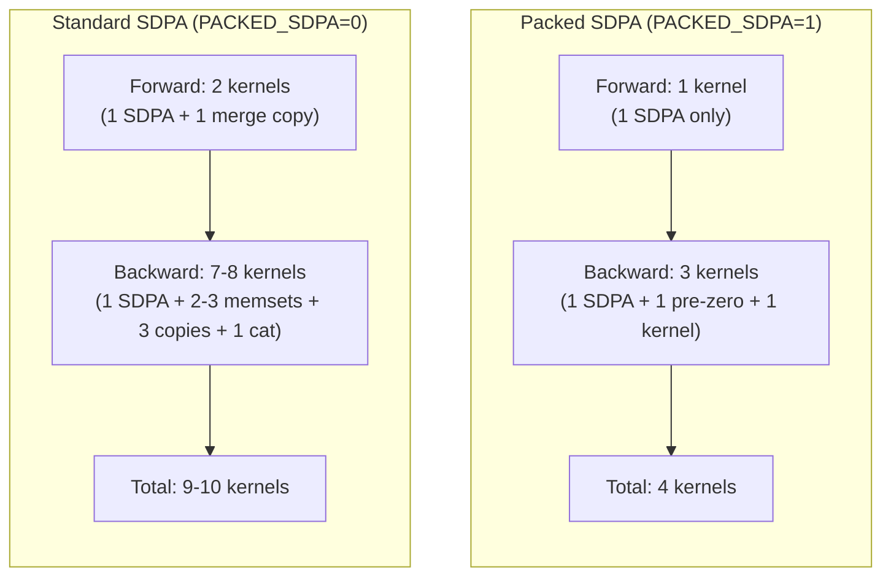

# SDPA Architecture: Standard vs Packed — Forward & Backward

> Verified against actual source code (May 6, 2026). Every operation traced
> through `gpt2_attn_navin.cpp`, `AttentionOps.cpp`, `AttentionBackward.cpp`,
> `ViewOps.cpp`, `ReshapeOps.cpp`, and `parallelizeutilsBackward.cpp`.

---

## Path 1 — Standard (Unfused) SDPA Forward

**Source**: `gpt2_attn_navin.cpp:183-198`, `AttentionOps.cpp:258-333`, `ViewOps.cpp:58-108`

```
qkv [B, T, 3C]  (contiguous output from c_attn Linear / cublasLt GEMM)
    │
    ▼
make_shards_inplace_axis(3, axis=2)                        ← METADATA ONLY
    │   Splits along dim-2 (the 3C dimension).
    │   Creates 3 aliased VIEWS into the same storage:
    │     q [B, T, C]  stride={T·3C, 3C, 1}  offset=0
    │     k [B, T, C]  stride={T·3C, 3C, 1}  offset=C
    │     v [B, T, C]  stride={T·3C, 3C, 1}  offset=2C
    │   No data movement — just metadata.
    ▼
autograd::reshape(q, [B, T, nh, hd])                       ← VIEW (smart reshape)
    │   compute_view_stride detects that splitting the innermost
    │   contiguous dim C=768 into nh×hd = 12×64 is view-eligible
    │   (stride[-1]=1, and 12×64=768 matches dim size).
    │   Result: VIEW with strides {T·3C, 3C, 64, 1}  ✓ NO COPY
    │   (same for k and v)
    ▼
autograd::transpose(q, 1, 2)                               ← VIEW
    │   Swaps dims 1 and 2:  [B, T, nh, hd] → [B, nh, T, hd]
    │   New strides: {T·3C, 64, 3C, 1}
    │   Still a VIEW — no data copy.
    │   (same for k and v)
    ▼
scaled_dot_product_attention(q, k, v)                      ← STRIDE-AWARE KERNEL
    │   Calls sdpa_memory_efficient() (AttentionOps.cpp:258).
    │   Lines 282-284: reads strides directly from q, k, v.
    │   Line 296-302: passes strides to mem_efficient_attn_forward_tc.
    │   ✓ NO .contiguous() call — kernel handles non-contiguous input.
    │   Saves ORIGINAL strided q, k, v views for backward (line 310).
    │   Output: attn_out [B, nh, T, hd] CONTIGUOUS (newly allocated).
    │   Also returns LSE [B, nh, T] for backward.
    ▼
autograd::transpose(attn_out, 1, 2)                        ← VIEW
    │   [B, nh, T, hd] → [B, T, nh, hd]
    │   Strides: {nh·T·hd, hd, T·hd, 1} — non-contiguous.
    ▼
autograd::reshape({B, T, C})                               ← ⚠️ THE ONE COPY
    │   Tensor::reshape (ViewOps.cpp:78) calls compute_view_stride:
    │     Input: [B, T, nh, hd] with strides {nh·T·hd, hd, T·hd, 1}
    │     Merging [nh, hd] into C: needs stride[2]==hd*stride[3]=hd
    │     But stride[2]=T·hd ≠ hd → FAILS (unless T=1)
    │   Falls through to .contiguous() (ViewOps.cpp:94) + view.
    │   This is the ONE strided_inner_vec_copy kernel per layer.
    ▼
y [B, T, C]  contiguous → feeds into c_proj Linear
```

### Forward Kernel Count (Standard Path)

| Kernel | Count | Purpose |
|--------|-------|---------|
| `mem_efficient_attn_forward_tc` | 1 | The actual SDPA computation |
| `strided_inner_vec_copy` | **1** | output merge: `transpose(1,2).reshape(B,T,C)` |
| **Total extra copies** | **1** | |

---

## Path 2 — Packed SDPA Forward

**Source**: `AttentionOps.cpp:342-413`

```
qkv [B, T, 3C]  (contiguous output from c_attn Linear / cublasLt GEMM)
    │
    │  ── NO shard, NO reshape, NO transpose, NO .contiguous() ──
    │
    │  Just compute 3 raw pointers + strides (lines 379-381, 391-395):
    │    Q_ptr = qkv.data<float>() + 0      stride: {T·3C, 3C, hd, 1}
    │    K_ptr = qkv.data<float>() + C      stride: {T·3C, 3C, hd, 1}
    │    V_ptr = qkv.data<float>() + 2·C    stride: {T·3C, 3C, hd, 1}
    │
    │  These are NOT separate tensors — they're just pointer arithmetic
    │  into the SAME qkv storage with strided access patterns.
    │  The kernel reads Q[b][h][t][d] = Q_ptr[b*T*3C + t*3C + h*hd + d]
    │
    ▼
mem_efficient_attn_forward_tc(Q_ptr, K_ptr, V_ptr, ...)
    │   Kernel already supports arbitrary strides — it reads via
    │   Q_bh[qi * q_sM + k] where q_sM = 3C (not C).
    │   The interleaved stride pattern is invisible to the kernel.
    │
    │   Output: allocated as [B, T, C] contiguous directly (line 374)
    │           (strideB=T·C, strideM=C, strideH=hd)
    │   Also returns LSE [B, nh, T].
    ▼
y [B, T, C]  → feeds into c_proj Linear (ALREADY the right shape!)
```

### Forward Kernel Count (Packed Path)

| Kernel | Count | Purpose |
|--------|-------|---------|
| `mem_efficient_attn_forward_tc` | 1 | The actual SDPA computation |
| **Total extra copies** | **0** | |

> **Key insight**: Packed SDPA eliminates the 1 merge copy from the forward
> pass. The kernel writes output directly as `[B,T,C]` contiguous — no
> transpose+reshape needed afterward.

---

## Path 1 — Standard SDPA Backward

**Source**: `AttentionBackward.cpp:84-141`, `ReshapeOps.cpp:35-41`,
`TransposeBackward.cpp:9-17`, `parallelizeutilsBackward.cpp:11-38`

The autograd graph unwinds in reverse. Every node below is a real backward
node in the graph, traced from the actual `apply()` implementations.

```
grad_output [B, T, C]  contiguous (from c_proj backward)
    │
    ▼
ReshapeBackward::apply (ReshapeOps.cpp:35-41)
    │   grad.reshape({B, T, nh, hd})
    │   grad is contiguous [B,T,C], splitting C into nh×hd → VIEW ✓ NO COPY
    │   Result: [B, T, nh, hd] strides {T·C, C, hd, 1} — still contiguous view
    ▼
TransposeBackward::apply (TransposeBackward.cpp:9-17)
    │   grad.transpose(1, 2)
    │   [B, T, nh, hd] → [B, nh, T, hd]
    │   Strides: {T·C, hd, C, 1} — non-contiguous VIEW ✓ NO COPY
    ▼
MemEfficientAttentionBackward::apply (AttentionBackward.cpp:84-141)
    │
    │   Line 99: const Tensor& grad_output = grad_output_raw;
    │   ✓ NO .contiguous() — backward is STRIDE-AWARE too.
    │   Lines 119-124: reads strides from grad_output, saved q/k/v, output.
    │   Lines 127-138: passes all strides directly to kernel.
    │
    │   Saved tensors: the ORIGINAL strided q, k, v views (non-contiguous),
    │   plus contiguous output and LSE from forward.
    │
    │   Internal kernel memsets (for atomicAdd targets):
    │     cudaMemsetAsync(dQ, 0, ...)  — exp7 path
    │     cudaMemsetAsync(dK, 0, ...)  — exp11/12 path
    │     cudaMemsetAsync(dV, 0, ...)  — exp11/12 path
    │   (These are correct here because dQ/dK/dV are separate contiguous tensors)
    │
    │   Output: dQ, dK, dV each [B, nh, T, hd] CONTIGUOUS (Tensor::empty, line 107-109)
    │
    ├──→ dQ flows backward through q's autograd chain:
    │       TransposeBackward(1,2): dQ.transpose(1,2) → [B,T,nh,hd]  VIEW
    │       ReshapeBackward({B,T,C}): grad.reshape({B,T,C})
    │         Input strides: {nh·T·hd, hd, T·hd, 1} (non-contiguous)
    │         Merge [nh,hd]→C: stride[2]=T·hd ≠ hd → FAILS
    │         → .contiguous()  ← ⚠️ COPY #1
    │
    ├──→ dK flows backward through k's chain:
    │       TransposeBackward → ReshapeBackward → FAILS → ⚠️ COPY #2
    │
    └──→ dV flows backward through v's chain:
            TransposeBackward → ReshapeBackward → FAILS → ⚠️ COPY #3
    │
    ▼
Make_shards_inplace_axis_Backward::apply (parallelizeutilsBackward.cpp:11-38)
    │   Line 37: Tensor combined_grad = Tensor::cat(valid_grads, axis_);
    │   Receives 3 × [B, T, C] grads, cats along dim=2.
    │   → Allocates [B, T, 3C] and copies all three into it.
    │   ← ⚠️ cat_batched_kernel
    ▼
dqkv [B, T, 3C]  → feeds into c_attn Linear backward
```

### Backward Kernel Count (Standard Path)

| Kernel | Count | Purpose |
|--------|-------|---------|
| `cudaMemsetAsync` | 2-3 | Internal dQ/dK/dV zeroing (exp-path dependent) |
| `mem_efficient_attn_backward` | 1 | The actual backward |
| `strided_inner_vec_copy` | **3** | dQ, dK, dV each: transpose→reshape→.contiguous() |
| `cat_batched_kernel` | **1** | Recombine dQ+dK+dV → dqkv |
| **Total extra copy/cat kernels** | **4** | (3 merge copies + 1 cat) |

> **Note**: There is NO grad_output `.contiguous()` copy. The backward kernel
> is stride-aware (AttentionBackward.cpp:96-99) — grad_output goes in directly
> as a non-contiguous view. This was NOT always the case; the stride-aware
> backward change eliminated what used to be a 4th copy here.

---

## Path 2 — Packed SDPA Backward

**Source**: `AttentionBackward.cpp:150-210`

```
grad_output [B, T, C]  contiguous (from c_proj backward)
    │
    │  Already [B, T, C] — the forward output was packed [B, T, C].
    │  NO transpose or reshape in forward → NO TransposeBackward or
    │  ReshapeBackward nodes in the backward graph at all.
    │  grad_output arrives directly at PackedSDPABackward::apply.
    │
    │  Saved tensors from forward (line 401-403):
    │    qkv [B, T, 3C]  (the original packed input, detached)
    │    O   [B, T, C]   (the packed output)
    │    LSE [B, nh, T]
    │
    ▼
Allocate ONE tensor: dqkv = Tensor::zeros([B, T, 3C])     (line 171)
    │
    │  Compute 3 strided pointers into this single buffer (lines 177-179):
    │    dQ_ptr = dqkv.data<float>() + 0     stride: {T·3C, 3C, hd, 1}
    │    dK_ptr = dqkv.data<float>() + C     stride: {T·3C, 3C, hd, 1}
    │    dV_ptr = dqkv.data<float>() + 2·C   stride: {T·3C, 3C, hd, 1}
    │
    │  Same pointer trick as forward — dQ/dK/dV are interleaved
    │  inside dqkv, NOT separate contiguous blocks.
    │
    ▼
mem_efficient_attn_backward(..., skip_grad_zero=true)      (line 195-207)
    │
    │   skip_grad_zero=true means:
    │     ✗ NO cudaMemsetAsync(dQ, 0, ...) — we already zeroed dqkv
    │     ✗ NO cudaMemsetAsync(dK, 0, ...) — same buffer, already zero
    │     ✗ NO cudaMemsetAsync(dV, 0, ...) — same buffer, already zero
    │
    │   WHY skip? Because the kernel's internal memset assumes dQ/dK/dV
    │   are CONTIGUOUS blocks. But here they're INTERLEAVED (stride 3C
    │   between rows). A contiguous memset would corrupt neighboring
    │   gradients. We pre-zeroed the ENTIRE interleaved buffer instead.
    │
    │   The kernel writes gradients via the same stride-based indexing:
    │     dQ[b][h][t][d] = dQ_ptr[b*T*3C + t*3C + h*hd + d]
    │
    │   Output: dQ/dK/dV are written IN-PLACE into dqkv.
    ▼
return {dqkv}                                              (line 209)
    │
    │  ── NO transpose, NO .contiguous(), NO Tensor::cat ──
    │  The single dqkv buffer IS the gradient for qkv.
    │  Feeds DIRECTLY into c_attn Linear backward.
```

### Backward Kernel Count (Packed Path)

| Kernel | Count | Purpose |
|--------|-------|---------|
| `cudaMemsetAsync` | 1 | Pre-zero the entire dqkv buffer (via Tensor::zeros) |
| `mem_efficient_attn_backward` | 1 | The actual backward |
| **Total extra copy/cat kernels** | **0** | |

### Why the kernel CAN'T memset internally for packed layout

```
dqkv buffer (interleaved):
┌─────────┬─────────┬─────────┐
│ dQ[t=0] │ dK[t=0] │ dV[t=0] │  ← 3C floats per token
│ dQ[t=1] │ dK[t=1] │ dV[t=1] │
│ ...     │ ...     │ ...     │
└─────────┴─────────┴─────────┘

If kernel does cudaMemsetAsync(dQ_ptr, 0, B*nh*T*hd*sizeof(float)):
  → It would zero a CONTIGUOUS block of B*nh*T*hd floats starting at dQ_ptr
  → But dQ is NOT contiguous! It has stride 3C between rows.
  → The memset would OVERWRITE dK and dV data! ✗ CORRUPTION

Solution: Pre-zero the ENTIRE dqkv buffer ONCE (all 3C×T×B floats),
then tell the kernel skip_grad_zero=true so it doesn't touch the zeroing.
```

---

## Side-by-Side Summary

### Kernel Savings Per Attention Layer (Forward + Backward)

| | Standard | Packed | Saved |
|---|---------|--------|-------|
| **Forward merge copy** | 1 | 0 | **1** |
| **Backward dQ/dK/dV merge copies** | 3 | 0 | **3** |
| **Backward cat_batched** | 1 | 0 | **1** |
| **Internal memsets** | 2-3 | 1 (pre-zero) | **1-2** |
| **SDPA kernels (fwd+bwd)** | 2 | 2 | 0 |
| **Total per layer** | **9-10** | **4** | **5-6** |

With 12 attention layers in GPT-2, packed SDPA eliminates **60-72 extra kernels
per training step** (5-6 × 12). That's 60-72 fewer kernel launches, fewer
memory passes, and significant VRAM bandwidth savings.



### Memory Layout Visualization

#### Standard Path — Kernel reads strided Q/K/V directly (NO pre-SDPA copies)

```
qkv storage (shared by q, k, v views — kernel reads with stride=3C):
┌────────────────────────────────────────────────────────────┐
│ Q₀₀₀...Q₀₀₇₆₇ │ K₀₀₀...K₀₀₇₆₇ │ V₀₀₀...V₀₀₇₆₇ │  ← token 0
│ Q₀₁₀...Q₀₁₇₆₇ │ K₀₁₀...K₀₁₇₆₇ │ V₀₁₀...V₀₁₇₆₇ │  ← token 1
│ ...                                                       │
└────────────────────────────────────────────────────────────┘
  stride = 3C between tokens (interleaved Q/K/V)
  The stride-aware SDPA kernel reads this directly — NO separate allocations.

SDPA output — ONE new contiguous allocation:
┌──────────────────────────────┐
│ O: [B, nh, T, hd] contiguous │
└──────────────────────────────┘
  ↓ transpose(1,2) → non-contiguous view
  ↓ reshape({B,T,C}) → compute_view_stride fails → 1 COPY
┌──────────────────────────────┐
│ merged: [B, T, C] contiguous │  ← this is the ONE forward copy
└──────────────────────────────┘
```

#### Packed Path — Zero extra allocations

```
Same qkv storage — kernel reads DIRECTLY with stride=3C:
┌────────────────────────────────────────────────────────────┐
│ Q₀₀₀...Q₀₀₇₆₇ │ K₀₀₀...K₀₀₇₆₇ │ V₀₀₀...V₀₀₇₆₇ │  ← token 0
│ Q₀₁₀...Q₀₁₇₆₇ │ K₀₁₀...K₀₁₇₆₇ │ V₀₁₀...V₀₁₇₆₇ │  ← token 1
│ ...                                                       │
└────────────────────────────────────────────────────────────┘
  Q_ptr──┘           K_ptr──┘           V_ptr──┘
  All 3 are just pointer offsets. Zero extra VRAM.

Output written directly as [B,T,C] contiguous — no merge needed.
```
