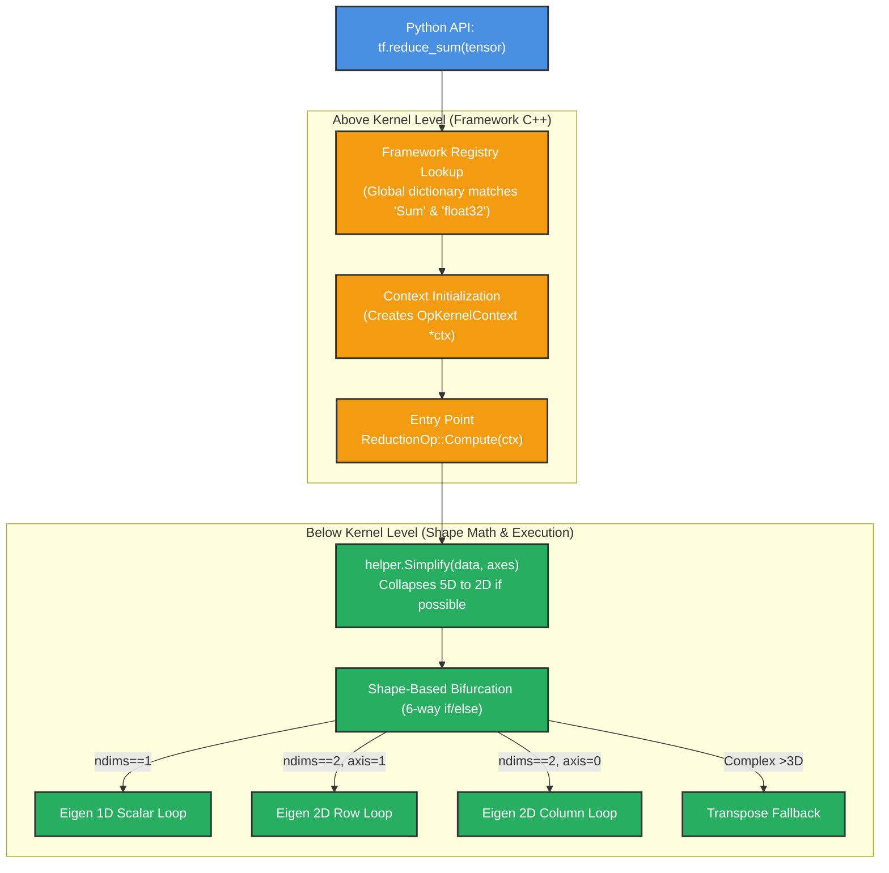
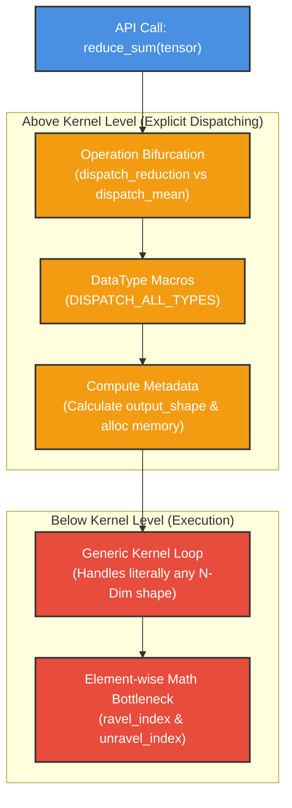

# Deep Dive: Reduction Architecture Flows (TensorFlow vs Custom Library)

This document provides a highly detailed, step-by-step technical breakdown of how a user's `reduce_sum` call navigates from the API down to the physical silicon execution in two different systems: our custom Tensor library (`master_gau_tensorflow`) and Google's TensorFlow.

The critical distinction between the two codebases lies in **where they bifurcate their execution logic.** 
*   **Our Custom Library** bifurcates *Above the Kernel* (based on the type of mathematical operation).
*   **TensorFlow** bifurcates *Below the Kernel* (based exclusively on the physical shape of the data in memory).

---

## 1. TensorFlow's Flow (Shape-Based Bifurcation)

TensorFlow's primary goal is to massage all data into perfectly contiguous `1D` or `2D` memory blocks so that its math engine (Eigen) can execute maximum-speed `for` loops without doing any index arithmetic (`unravel_index`).

### The Visual Flow

### Detailed Step-by-Step Breakdown

#### Step 1: The Python API
A user executes `result = tf.reduce_sum(tensor_A, axes=[1], keep_dims=True)`. The Python framework serialization engine packages these arguments into a generic `NodeDef` message and passes it to the C++ runtime.

#### Step 2: C++ Registry (Above Kernel Level)
The C++ Engine receives the request to execute "Sum". 
*   It looks up `"Sum"` in its global **Kernel Registry** (a massive `std::unordered_map` populated at compile time by macros like `REGISTER_KERNEL_BUILDER`).
*   It finds the specific C++ factory function registered to handle `Sum` for `float32` tensors on the `CPU`.

#### Step 3: OpKernelContext `ctx` Wrapper (Above Kernel Level)
TensorFlow creates an `OpKernelContext* ctx` object. Instead of passing standard arguments to C++ functions (e.g., `void func(Tensor a, int axis)`), TensorFlow packages *everything* into `ctx`.
*   `ctx->input(0)` holds `tensor_A`.
*   `ctx->input(1)` holds `axes=[1]`.
*   `ctx` also holds the memory allocator pointers necessary to create the output tensor.

#### Step 4: `ReductionOp::Compute` (The Entry Point)
All math operations in TF inherit from the `OpKernel` C++ class. Thus, they must implement a function called `Compute()`. The engine drops into `ReductionOp::Compute(ctx)` to begin real work.

#### Step 5: `helper.Simplify()` (Below Kernel Level starts here)
This is TensorFlow's secret weapon. Before running any math, `Compute()` calls `ReductionHelper::Simplify()`.
*   It scans the tensor's dimensions.
*   It deletes dimensions of size 1.
*   It multiplies adjacent dimensions that share the same reduction fate.
*   **Result:** A complex `[2, 3, 4, 5]` shape might dynamically collapse into a simple `[6, 20]` 2D matrix.

#### Step 6: Shape-Based Bifurcation
`Compute()` now uses a 6-way `if/else` block based on the *simplified shape*:
*   `if ndims() == 1`: Route to 1D scalar math.
*   `if ndims() == 2 && reduce_first_axis`: Route to 2D Column processing.
*   `if ndims() == 2 && !reduce_first_axis`: Route to 2D Row processing.

#### Step 7: Eigen Math Execution
TensorFlow hands the data to its 3rd-party math library (Eigen). Because the shape is guaranteed to be a pure 1D or 2D abstraction, Eigen executes hyper-optimized, contiguous `for` loops in hardware with cache-awareness. It **never** has to divide or modulo indices to find coordinates.

---

## 2. Our Custom Library Flow (Operation-Based Bifurcation)

Our library's primary architectural philosophy aims to keep the C++ dispatching extremely organized and explicit based on mathematical families, leaving shape calculations strictly to the kernel loop execution.

### The Visual Flow

### Detailed Step-by-Step Breakdown

#### Step 1: The API Entry
A user calls `result = reduce_sum(tensor_A)`. This maps directly to our C++ function `Tensor reduce_sum(const Tensor& input, ...)`. There is no string-serialization or registry lookup required.

#### Step 2: Operation Bifurcation (Above Kernel Level)
Our code immediately bifurcates based on the **mathematical behavior** required.
*   Is it an Index-returning operation (`ArgMax`)? Route to `dispatch_index_reduction` to ensure `int64` output.
*   Is it a Mean/Variance operation requiring two passes? Route to `dispatch_mean` handling `float64` accumulators.
*   Is it a standard value reducer (`Sum`, `Max`)? Route to `dispatch_reduction_cpu`.

#### Step 3: DataType Dispatch (Above Kernel Level)
Inside the dispatcher, our `DISPATCH_ALL_TYPES` macro unwraps to an explicit `switch(data_type)` statement, routing the execution to a specific compiled C++ template (e.g., `float32`).

#### Step 4: Metadata Computation
The CPU code calculates the expected output dimensions (`calculate_output_shape`) and allocates the required raw memory bytes. It then unpacks the strides and passes raw `float*` pointers down to the kernel function.

#### Step 5: Generic N-Dimensional Kernel (Below Kernel Level)
Unlike TensorFlow, which splits its math loops into 6 different physical shape variants (1D, 2DRow, 3D... etc), our library drops into exactly **one** generic `for` loop.

#### Step 6: `unravel_index` (The Bottleneck)
Because our single loop attempts to support any shape from 1D up to 10D flawlessly, it cannot assume memory is contiguous.
*   For every single float it processes in the `for` loop, it must call `unravel_index`.
*   `unravel_index` mathematically calculates exactly where that element lives in an N-Dimensional grid using repeated division (`/`) and modulo (`%`) algorithms.
*   This generic N-dimensional capability costs extreme execution time, acting as the primary bottleneck compared to TensorFlow's shape-collapsed contiguous loops.

---

### Conclusion
By adopting TensorFlow's `helper.Simplify()` and the subsequent 6-way branch inside our C++ loops, we will maintain our highly-organized "Above Kernel" operation architecture, while completely eliminating the `unravel_index` overhead "Below the Kernel".
