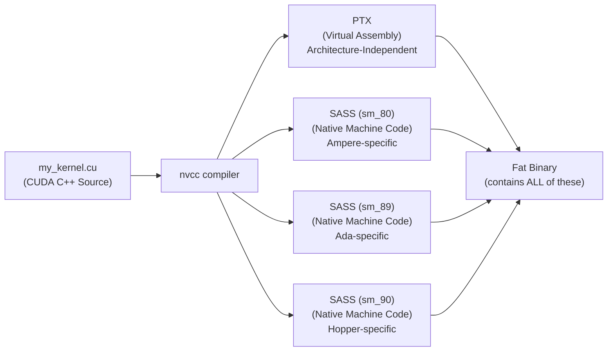
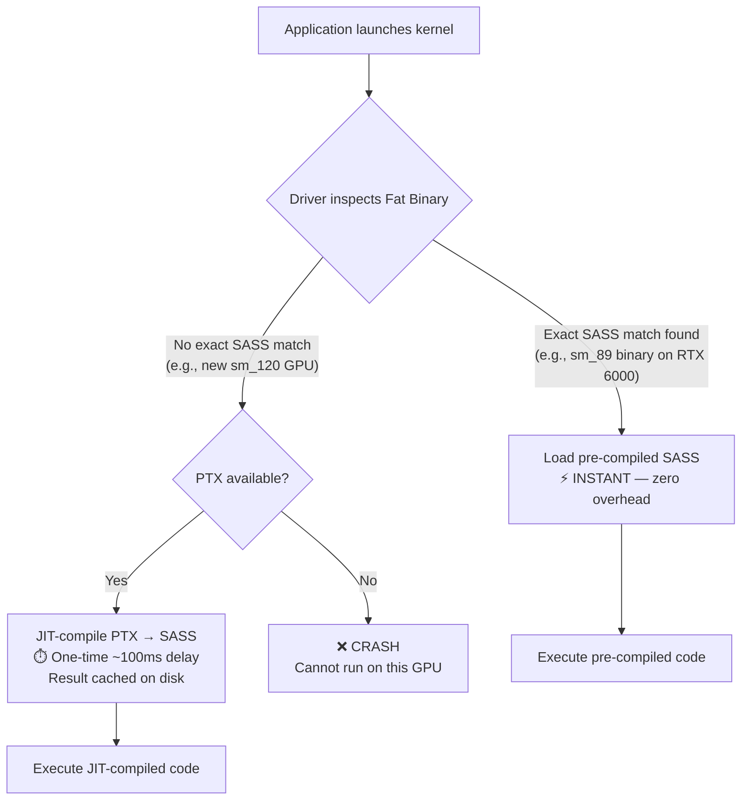
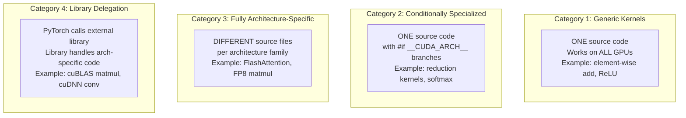
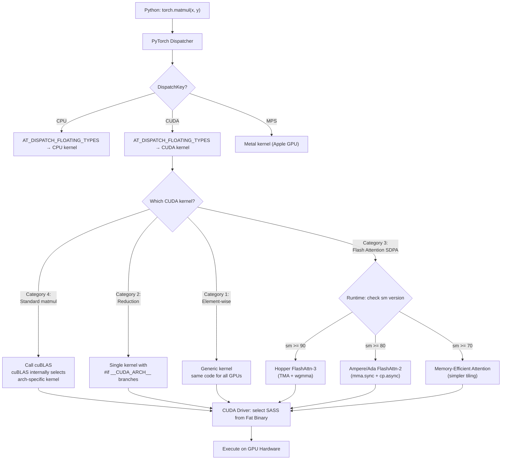
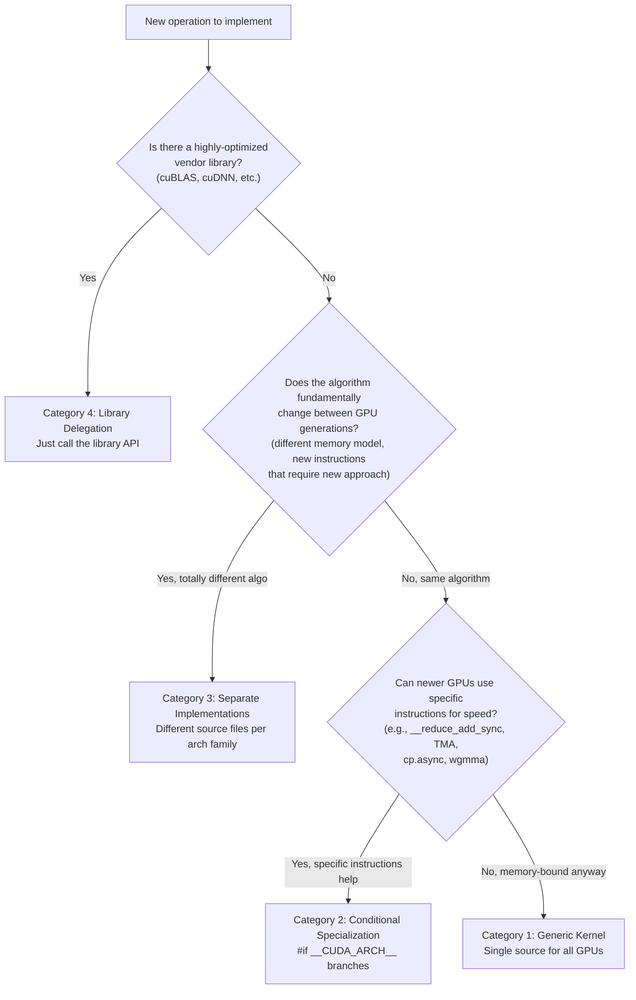

# How PyTorch Maintains CUDA Kernels Across All GPU Architectures

## The Core Question

> "Do they write different kernels for different GPUs, or one kernel for all?"

**The answer is: It depends on the operation.** PyTorch uses a **layered strategy** with **4 distinct categories** of kernels. Some operations use a single generic kernel for ALL GPUs. Some use entirely different kernel implementations per architecture. And most use a hybrid approach. Let's break down exactly how this works.

---

## 1. The Mental Model: Two Completely Different Levels of "Architecture Support"

There are **two separate problems** that PyTorch solves, and people often confuse them:

| Level | What It Solves | Mechanism |
|-------|---------------|-----------|
| **Level 1: Compilation** | "Can my binary *run* on this GPU at all?" | Fat Binary (PTX + SASS) via `nvcc` |
| **Level 2: Optimization** | "Does my kernel *exploit* this GPU's unique hardware?" | Different kernel code paths, different algorithms |

> [!IMPORTANT]
> **Level 1 is about compatibility. Level 2 is about performance.** A single kernel compiled with PTX will *run* on any future GPU (Level 1), but it won't necessarily be *fast* on that GPU because it doesn't know about new hardware features (Level 2).

---

## 2. Level 1: The CUDA Compilation Model (How ONE Kernel Runs on ALL GPUs)

### 2.1 The Compilation Pipeline

When `nvcc` compiles a `.cu` file, it produces two types of output:



- **PTX (Parallel Thread Execution)**: An *intermediate virtual assembly* — think of it like Java bytecode for GPUs. It's NOT tied to any specific GPU chip. The CUDA driver can JIT-compile it to native code for ANY GPU.
- **SASS (Shader ASSembly)**: The *actual native machine code* for a specific GPU chip. Pre-compiled, zero JIT overhead, maximum performance.

### 2.2 What Happens at Runtime



### 2.3 PyTorch's Build Strategy

When PyTorch builds its `pip` wheel, the build system sets:

```bash
# Example (approximate) for a recent PyTorch release:
TORCH_CUDA_ARCH_LIST="5.0;6.0;6.1;7.0;7.5;8.0;8.6;8.9;9.0;9.0a;12.0"
```

This generates the `nvcc` flags:
```bash
nvcc my_kernel.cu \
  -gencode arch=compute_50,code=sm_50    \  # Maxwell
  -gencode arch=compute_60,code=sm_60    \  # Pascal P100
  -gencode arch=compute_61,code=sm_61    \  # Pascal GTX 1080
  -gencode arch=compute_70,code=sm_70    \  # Volta V100
  -gencode arch=compute_75,code=sm_75    \  # Turing RTX 2080
  -gencode arch=compute_80,code=sm_80    \  # Ampere A100
  -gencode arch=compute_86,code=sm_86    \  # Ampere RTX 3090
  -gencode arch=compute_89,code=sm_89    \  # Ada RTX 4090/6000  ← YOUR GPU
  -gencode arch=compute_90,code=sm_90    \  # Hopper H100
  -gencode arch=compute_90a,code=sm_90a  \  # Hopper (arch-specific features)
  -gencode arch=compute_120,code=compute_120  # ← PTX only! Forward compat for Blackwell+
```

> [!NOTE]  
> Notice the **last line**: `code=compute_120` (not `sm_120`). This embeds *only PTX*, not SASS. This is the **forward compatibility safety net** — if someone runs PyTorch on a future `sm_130` GPU, the driver will JIT-compile the `compute_120` PTX into native `sm_130` SASS. It'll work, but may not be maximally optimized.

### 2.4 What This Means For Your Ada RTX 6000 (sm_89)

Since PyTorch's pip wheel includes `sm_89` SASS:
- **Your GPU gets pre-compiled native code** — zero JIT overhead
- The SASS is compiled using the `compute_89` virtual architecture, so it CAN use Ada-specific instructions (like FP8 tensor core instructions, `cp.async` optimizations, etc.)
- But whether it ACTUALLY uses them depends on Level 2 (the kernel source code)

---

## 3. Level 2: The Kernel Source Code Strategy (4 Categories)

This is where the real engineering happens. Not all kernels are equal:



### 3.1 Category 1: Generic Kernels (ONE kernel for ALL GPUs)

**What**: A single kernel source that works identically on every GPU from Maxwell to Blackwell.

**When used**: Simple, memory-bound operations where the algorithm doesn't change across architectures.

**Examples**: `torch.add`, `torch.mul`, `torch.relu`, `torch.sigmoid`, element-wise operations, simple indexing, fill operations.

```cpp
// This kernel runs on EVERY GPU — sm_50 through sm_120+
// No architecture-specific code whatsoever
template <typename scalar_t>
__global__ void add_kernel(const scalar_t* a, const scalar_t* b, 
                           scalar_t* out, int64_t n) {
    int idx = blockIdx.x * blockDim.x + threadIdx.x;
    if (idx < n) {
        out[idx] = a[idx] + b[idx];
    }
}
```

**Why one kernel is enough**: 
- These are **memory-bound** — the GPU spends most of its time waiting for data from DRAM, not computing
- Adding more fancy instructions doesn't help because the bottleneck is memory bandwidth, not compute
- The CUDA compiler (`nvcc`) automatically handles register allocation, instruction scheduling, and warp-level details for each architecture when it compiles the same source to different SASS

> [!TIP]
> Even though the *source code* is identical, the *compiled SASS* will be different for each architecture! `nvcc` optimizes register usage, instruction selection, and scheduling per-target. So you DO get architecture-specific optimization — it just comes from the **compiler**, not from the **programmer**.

### 3.2 Category 2: Conditionally Specialized Kernels (`#if __CUDA_ARCH__` branches)

**What**: A single kernel source file with compile-time branches that activate different code paths for different GPU generations.

**When used**: Operations where newer GPUs have specific instructions or capabilities that provide significant speedups for the *same algorithm*.

**Examples**: Reduction kernels (using `__shfl_sync` variants), softmax, layer norm, BF16 operations, async memory copies.

```cpp
template <typename scalar_t>
__global__ void optimized_reduce_kernel(const scalar_t* input, 
                                        scalar_t* output, int n) {
    // Shared memory for block-level reduction
    __shared__ scalar_t sdata[256];
    
    int tid = threadIdx.x;
    int idx = blockIdx.x * blockDim.x + threadIdx.x;
    
    sdata[tid] = (idx < n) ? input[idx] : 0;
    __syncthreads();
    
    // Standard tree reduction in shared memory
    for (int s = blockDim.x / 2; s > 32; s >>= 1) {
        if (tid < s) sdata[tid] += sdata[tid + s];
        __syncthreads();
    }
    
    // Warp-level reduction — THIS is where arch matters
    if (tid < 32) {
        scalar_t val = sdata[tid];
        
#if defined(__CUDA_ARCH__) && (__CUDA_ARCH__ >= 800)
        // Ampere+ : Use __reduce_add_sync for hardware-accelerated warp reduce
        // This is a SINGLE INSTRUCTION on sm_80+ that replaces the entire
        // shuffle-reduce loop below
        val = __reduce_add_sync(0xffffffff, val);
#elif defined(__CUDA_ARCH__) && (__CUDA_ARCH__ >= 700)
        // Volta/Turing: Use __shfl_down_sync (requires explicit mask)
        for (int offset = 16; offset > 0; offset >>= 1) {
            val += __shfl_down_sync(0xffffffff, val, offset);
        }
#else
        // Pre-Volta: Use volatile shared memory trick (no sync needed in warp)
        volatile scalar_t* smem = sdata;
        if (tid < 32) { smem[tid] += smem[tid + 32]; }
        if (tid < 16) { smem[tid] += smem[tid + 16]; }
        if (tid < 8)  { smem[tid] += smem[tid + 8]; }
        if (tid < 4)  { smem[tid] += smem[tid + 4]; }
        if (tid < 2)  { smem[tid] += smem[tid + 2]; }
        if (tid < 1)  { smem[tid] += smem[tid + 1]; }
        val = smem[0];
#endif
        
        if (tid == 0) output[blockIdx.x] = val;
    }
}
```

**How `__CUDA_ARCH__` works**: 
- `nvcc` compiles your kernel **multiple times** — once for each `-gencode` target
- When compiling for `sm_89`, `__CUDA_ARCH__` is defined as `890`
- When compiling for `sm_70`, `__CUDA_ARCH__` is defined as `700`
- The preprocessor strips out the inapplicable branches at compile time
- The fat binary ends up with a **different SASS version** for each architecture, even from the same source file

```
Same .cu file → nvcc compiles N times → N different SASS binaries in fat binary
                                         (each with different #if branches taken)
```

### 3.3 Category 3: Fully Architecture-Specific Kernels (DIFFERENT implementations)

**What**: Entirely separate kernel source files, algorithms, or data structures per GPU generation. Not just `#if` branches — fundamentally different approaches.

**When used**: Cutting-edge compute-bound operations where each GPU generation introduces hardware that demands a totally different algorithm design.

**The #1 Example: FlashAttention**

| Version | Target Architecture | Key Difference |
|---------|-------------------|----------------|
| FlashAttention-2 | sm_80 (Ampere) | Online softmax + tiled GEMM via `mma.sync` |
| FlashAttention-2 | sm_89 (Ada) | Same algorithm, tuned tile sizes for Ada's L2 cache |
| FlashAttention-3 | sm_90 (Hopper) | **Completely different**: uses TMA (Tensor Memory Accelerator), `wgmma` instructions, pipelined producer-consumer model, FP8 support |

The Hopper kernel is **not** an `#if` branch of the Ampere kernel. It's a fundamentally different file:

```
flash-attn/
├── csrc/
│   ├── flash_attn/
│   │   ├── src/                          # Ampere/Ada kernels (sm_80, sm_89)
│   │   │   ├── flash_fwd_kernel.h
│   │   │   ├── flash_bwd_kernel.h
│   │   │   └── ...
│   │   ├── hopper/                       # COMPLETELY SEPARATE Hopper kernels
│   │   │   ├── flash_fwd_kernel_sm90.h   # Different algorithm!
│   │   │   ├── flash_bwd_kernel_sm90.h
│   │   │   ├── mainloop_fwd_sm90.hpp     # Uses CUTLASS 3.x + TMA
│   │   │   └── ...
│   │   └── flash_api.cpp                 # Runtime dispatch:
│   │       │                             #   if sm >= 90 → use hopper/
│   │       │                             #   else        → use src/
```

**The dispatch logic at runtime** (simplified from PyTorch's SDPA):

```cpp
// In PyTorch's C++ backend (simplified)
at::Tensor scaled_dot_product_attention(
    const at::Tensor& query,
    const at::Tensor& key,
    const at::Tensor& value) {
    
    // Get the GPU's compute capability at RUNTIME
    auto device_prop = at::cuda::getCurrentDeviceProperties();
    int sm = device_prop->major * 10 + device_prop->minor;
    
    if (sm >= 90) {
        // Hopper path — completely different algorithm
        return flash_attention_hopper(query, key, value);
    } else if (sm >= 80) {
        // Ampere/Ada path
        return flash_attention_v2(query, key, value);
    } else if (sm >= 70) {
        // Volta fallback — memory-efficient attention
        return memory_efficient_attention(query, key, value);
    } else {
        // Ancient GPU — naive quadratic attention
        return naive_sdpa(query, key, value);
    }
}
```

**Other examples of Category 3**:
- **FP8 matmul**: Only exists for sm_89+ (Ada) and sm_90+ (Hopper) — completely different from FP16/FP32 matmul
- **Warp-specialized kernels**: Hopper's warp specialization (producer/consumer model) is a radically different programming paradigm from Ampere
- **TMA-based data movement**: Only available on sm_90+, requires fundamentally different memory access patterns

### 3.4 Category 4: Library Delegation (Let NVIDIA Handle It)

**What**: PyTorch doesn't write the kernel at all. It calls into a vendor library (cuBLAS, cuDNN, cuSPARSE, etc.) and lets NVIDIA's engineers handle all the architecture-specific optimization.

**When used**: Well-studied, standard operations where NVIDIA has invested years of optimization.

**Examples**:
- **Matrix multiplication** → cuBLAS / cuBLASLt
- **Convolutions** → cuDNN
- **FFT** → cuFFT
- **Sparse operations** → cuSPARSE

```cpp
// PyTorch's matmul — it DOES NOT write the GEMM kernel itself
// It calls cuBLAS, which internally has hundreds of architecture-specific kernels
void addmm_out_cuda_impl(Tensor& result, const Tensor& self, 
                          const Tensor& mat1, const Tensor& mat2, 
                          const Scalar& beta, const Scalar& alpha) {
    // ... setup ...
    
    // This single call dispatches internally to the correct
    // architecture-specific kernel inside cuBLAS
    at::cuda::blas::gemm<float>(
        transa, transb,
        m, n, k,
        alpha_val,
        mat1_ptr, lda,
        mat2_ptr, ldb,
        beta_val,
        result_ptr, ldc
    );
    // cuBLAS internally selects from ~500+ kernel variants
    // based on: architecture, matrix dimensions, data types,
    // alignment, and heuristic performance models
}
```

> [!IMPORTANT]
> **cuBLAS alone contains ~500+ different GEMM kernel variants** internally. For each GPU architecture, for each data type, for each matrix shape class, NVIDIA has hand-tuned kernels. When you call `cublasGemmEx()`, cuBLAS's internal heuristic engine selects the optimal kernel. This is why `torch.matmul` is so hard to beat — you're competing against years of per-architecture optimization by NVIDIA's internal team.

---

## 4. The Complete Dispatch Architecture

Here's how all the layers compose together when you call a PyTorch operation:



---

## 5. The Decision Framework: How PyTorch Decides Which Strategy to Use

Here's the mental model the PyTorch team uses to decide which category each kernel falls into:



### Key Insight: It's About the Bottleneck

| Bottleneck | Strategy | Why |
|-----------|----------|-----|
| **Memory bandwidth** | Category 1 (generic) | All GPUs read memory the same way; fancy instructions don't help |
| **Compute (simple)** | Category 2 (conditional) | Newer GPUs have faster/specialized instructions for the same algorithm |
| **Compute (complex)** | Category 3 (separate) | The algorithm itself must change to exploit new hardware paradigms |
| **Well-studied primitive** | Category 4 (library) | NVIDIA already spent thousands of engineer-hours optimizing this |

---

## 6. Connecting This To YOUR Project (Ada RTX 6000, sm_89)

Looking at your project (`master_gau_latest_ada_6000_sm89`), your Makefile targets **only** `sm_89`:

```makefile
# Your compilation:
nvcc -arch=sm_89 ...
```

This means:
1. **Your kernels produce SASS only for sm_89** — they will NOT run on any other GPU
2. **No PTX fallback** — no forward compatibility
3. **No fat binary** — smallest possible binary, fastest possible compilation
4. **This is the correct choice** for your use case (single-target performance optimization)

### How your kernels map to the 4 categories:

| Your Component | Category | What Happens |
|---------------|----------|--------------|
| Custom contiguous copy kernel | Cat 1/2 | Generic algorithm, but you could add sm_89 `cp.async` for async copies |
| Matmul (via cuBLASLt) | Cat 4 | cuBLAS internally picks the best sm_89 GEMM kernel |
| SDPA/FlashAttention | Cat 3 | You use the Ampere/Ada code path (not Hopper) |
| Sparse cross-entropy | Cat 1 | Your custom reduction — same algorithm works everywhere |
| Activation backward | Cat 1 | Element-wise — memory-bound, no arch-specific code needed |

---

## 7. The Maintenance Cost Reality

Here's the honest truth about what this costs at the PyTorch scale:

| Category | Code Complexity | Maintenance Burden | Performance |
|----------|----------------|-------------------|-------------|
| 1 (Generic) | Low | Low — write once, works forever | Good (compiler optimizes per-arch) |
| 2 (Conditional) | Medium | Medium — must add branches for new GPU features | Better (uses arch-specific instructions) |
| 3 (Separate) | Very High | Very High — must write+test new impl per arch family | Best (algorithm designed for hardware) |
| 4 (Library) | Low for PyTorch | Zero — NVIDIA maintains it | Best (hand-tuned by NVIDIA engineers) |

### The Trend: torch.compile + Triton

PyTorch is increasingly moving toward **Category 5** (not in my list above): **compiler-generated kernels**:

```python
@torch.compile
def fused_attention(q, k, v):
    scores = torch.matmul(q, k.transpose(-2, -1)) / math.sqrt(d_k)
    weights = torch.softmax(scores, dim=-1)
    return torch.matmul(weights, v)
```

The Inductor compiler + Triton backend:
1. Takes the high-level Python description
2. **Automatically generates** a fused CUDA kernel
3. **Automatically tunes** tile sizes, vectorization, memory access patterns for the detected GPU
4. Produces architecture-optimized code **without any manual `#if __CUDA_ARCH__` branches**

This is the future direction — reduce the manual maintenance burden of Categories 2 and 3.

---

## 8. Summary: The Complete Answer

| Question | Answer |
|----------|--------|
| "One kernel for all GPUs?" | **For simple ops (add, relu, etc.): YES** — one source, compiler handles the rest |
| "Different kernels for different archs?" | **For complex ops (attention, FP8): YES** — entirely separate implementations |
| "How does it work for matmul?" | **NVIDIA handles it** — cuBLAS has ~500+ internal kernel variants |
| "How does binary compatibility work?" | **Fat binary** = pre-compiled SASS per arch + PTX for forward compat |
| "What happens on an unknown future GPU?" | **PTX JIT compilation** — driver compiles PTX to native code at runtime |
| "How does PyTorch decide which kernel to run?" | **Runtime dispatch** — checks `cudaDeviceProp.major/minor` and selects code path |
| "Why can't they just write one kernel?" | **Hardware is too different** — Hopper's TMA/wgmma is a fundamentally different programming model than Ampere's mma.sync |
| "How to think about this for my own project?" | **Target your specific GPU** (sm_89), delegate to cuBLAS where possible, write generic kernels for simple ops, only specialize where profiling shows it matters |
