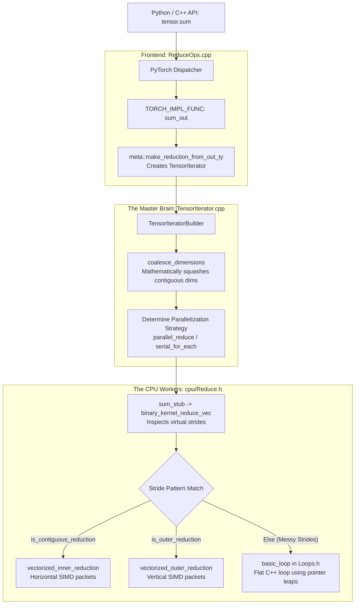

# PyTorch Reductions: A Deep Architectural Analysis

Unlike TensorFlow, which relies heavily on Eigen's compile-time template metaprogramming, PyTorch takes a radically different **dynamic, runtime-based approach**. 

Instead of generating fixed loops for different dimensional shapes (1D, 2D) and transposing everything else, PyTorch uses a master planning engine called **`TensorIterator`**. It mathematically squashes dimensions and computes custom pointer jumps (strides) on the fly, feeding them into a flat C++ loop.

Here is the exact step-by-step trace of what happens when you call `tensor.sum(dim=1)` in PyTorch, followed by a visual breakdown.

## 1. The Entry Point ([ReduceOps.cpp](file:///home/blu-bridge016/Downloads/Neural_Networks_exp_1926/pytorch_source/aten/src/ATen/native/ReduceOps.cpp))
When you execute a reduction in PyTorch, it hits the Dispatcher and lands in [aten/src/ATen/native/ReduceOps.cpp](file:///home/blu-bridge016/Downloads/Neural_Networks_exp_1926/pytorch_source/aten/src/ATen/native/ReduceOps.cpp). 

```cpp
TORCH_IMPL_FUNC(sum_out)(const Tensor& self, OptionalIntArrayRef opt_dim, ...) {
    // 1. Create the TensorIterator!
    auto iter = meta::make_reduction_from_out_ty(self, result, opt_dim, ...);
    
    // 2. Pass it to the CPU/GPU stub
    sum_stub(iter.device_type(), iter);
}
```
Notice there are no `if/else` checks for `ndims == 1` or `ndims == 2` here. The tensor metadata is immediately handed over to `TensorIterator`.

## 2. The Master Brain: `TensorIterator`
This is PyTorch's secret weapon. `TensorIterator` (located in [aten/src/ATen/TensorIterator.cpp](file:///home/blu-bridge016/Downloads/Neural_Networks_exp_1926/pytorch_source/aten/src/ATen/TensorIterator.cpp)) analyzes the tensor's memory layout.

The most important step is **[coalesce_dimensions()](file:///home/blu-bridge016/Downloads/Neural_Networks_exp_1926/pytorch_source/aten/src/ATen/TensorIterator.cpp#638-690)**:
Instead of [reshape](file:///home/blu-bridge016/Downloads/Neural_Networks_exp_1926/tensorflow/tensorflow/core/kernels/reduction_ops_common.cc#22-27) or physical RAM [transpose](file:///home/blu-bridge016/Downloads/Neural_Networks_exp_1926/bench_transpose), PyTorch mathematically squashes dimensions together if they are adjacent in memory. 

If you have a 5D tensor `[2, 30, 30, 30, 30]` and you are reducing the first dimension, TensorIterator looks at the memory strides:
```cpp
// From TensorIterator.cpp - coalesce_dimensions()
if (shape0 * stride[dim0] != stride[dim1]) {
  // Dimensions can be mathematically collapsed!
}
```
It merges the outer 4 dimensions into one single massive 1D line in memory. It reduces the problem from a messy 5D loop to a simple 2D loop seamlessly without moving a single byte of memory.

## 3. The CPU Workers ([cpu/Reduce.h](file:///home/blu-bridge016/Downloads/Neural_Networks_exp_1926/pytorch_source/aten/src/ATen/native/cpu/Reduce.h) & [cpu/Loops.h](file:///home/blu-bridge016/Downloads/Neural_Networks_exp_1926/pytorch_source/aten/src/ATen/native/cpu/Loops.h))
Once `TensorIterator` has calculated the squashed virtual shapes and memory strides, the CPU stub invokes [aten/src/ATen/native/cpu/Reduce.h](file:///home/blu-bridge016/Downloads/Neural_Networks_exp_1926/pytorch_source/aten/src/ATen/native/cpu/Reduce.h).

Specifically, [binary_kernel_reduce_vec](file:///home/blu-bridge016/Downloads/Neural_Networks_exp_1926/pytorch_source/aten/src/ATen/native/cpu/Reduce.h#250-281) inspects the new virtual strides and launches one of three loop strategies:

1. **[is_contiguous_reduction](file:///home/blu-bridge016/Downloads/Neural_Networks_exp_1926/pytorch_source/aten/src/ATen/native/cpu/Reduce.h#21-27)**: The reduced dimensions are adjacent in memory (Fastest, horizontal SIMD).
2. **[is_outer_reduction](file:///home/blu-bridge016/Downloads/Neural_Networks_exp_1926/pytorch_source/aten/src/ATen/native/cpu/Reduce.h#28-35)**: The reduction hops evenly downwards (Vertical SIMD).
3. **The Fallback ([basic_loop](file:///home/blu-bridge016/Downloads/Neural_Networks_exp_1926/pytorch_source/aten/src/ATen/native/cpu/Loops.h#112-129))**: If it's a messy reduction (like TensorFlow's worst-case 3D-XZ), it just loops using standard pointer arithmetic across the virtual strides in [Loops.h](file:///home/blu-bridge016/Downloads/Neural_Networks_exp_1926/pytorch_source/aten/src/ATen/native/cpu/Loops.h).

---

## The Visual Flow



### Contrast with TensorFlow/Eigen
*   **TensorFlow:** Tries to perfectly map shapes to Eigen templates (e.g., `GenericDimReducer<2>`). If it gets an N-dimensional shape it doesn't like, it physically copies and transposes data in RAM (`DoTranspose`), which is slow but keeps compile-time low and limits the template size.
*   **PyTorch:** Uses `TensorIterator` to calculate stride math dynamically at runtime. It **never transposes** the data. If the memory access pattern is weird, it simply runs a flat 1D C++ loop ([basic_loop](file:///home/blu-bridge016/Downloads/Neural_Networks_exp_1926/pytorch_source/aten/src/ATen/native/cpu/Loops.h#112-129)) that jumps through memory using the calculated strides. Less boilerplate, zero memory copying, highly flexible!
