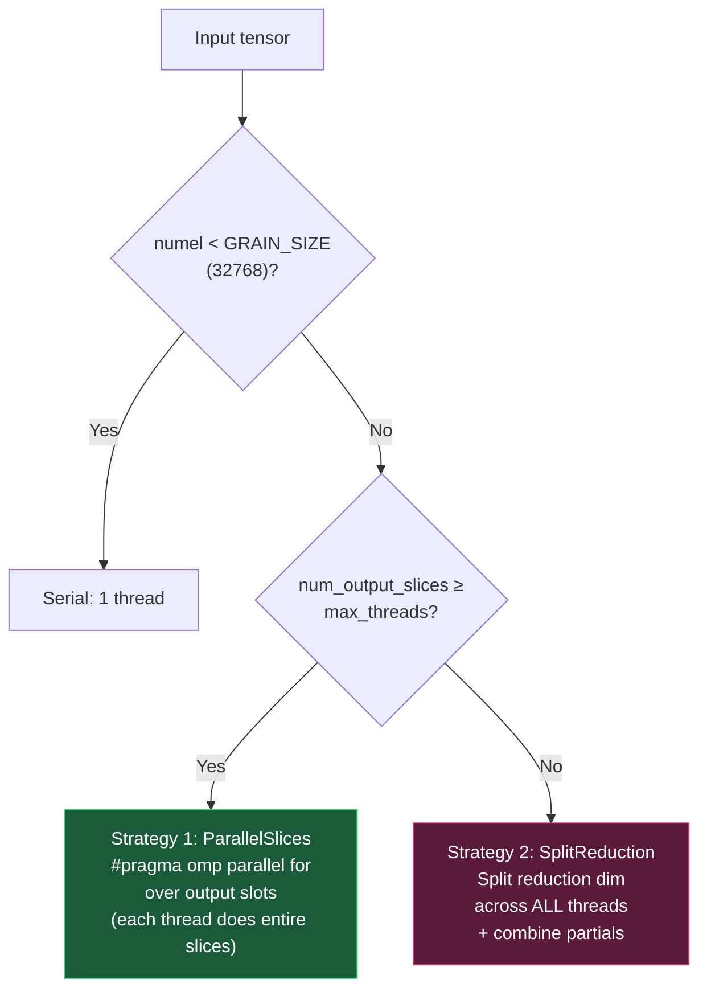
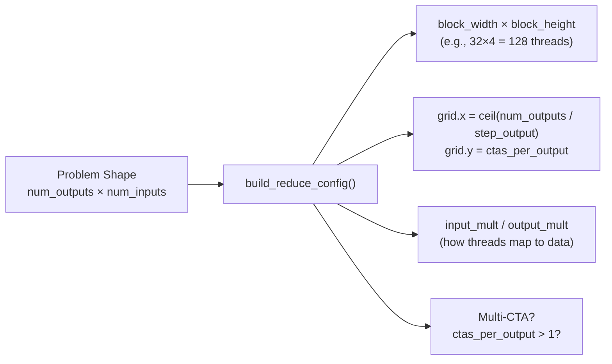
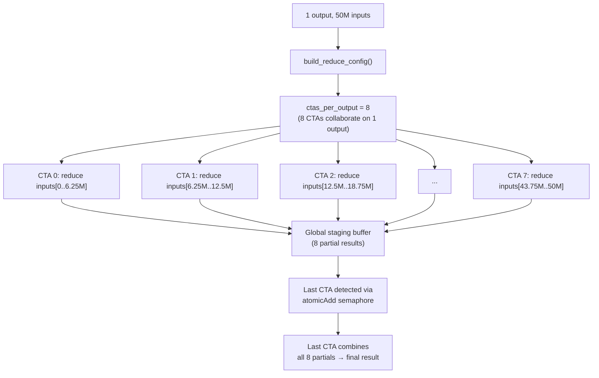

# BluTrain Reduction Algorithm — Deep Dive with Visual Architecture

> How the reduction engine works from first principles, every optimization explained visually.

---

## Table of Contents

1. [What is a Reduction?](#what-is-reduction)
2. [The 3 Layout Paths — Visualized](#layout-paths)
3. [CPU Optimizations — 5 Layers Deep](#cpu-optimizations)
4. [GPU Optimizations — 6 Layers Deep](#gpu-optimizations)
5. [Multi-CTA Global Reduce — The Hardest Part](#multi-cta)
6. [Optimization Summary Table](#summary)

---

## 1. What is a Reduction? {#what-is-reduction}

A reduction collapses elements along one or more axes using an operation (sum, min, max, etc.):

```
Input tensor [4, 6]:                    Output (sum axis=1):
┌──────────────────────────┐            ┌──────┐
│  1   2   3   4   5   6  │  ──sum──►  │  21  │
│  7   8   9  10  11  12  │  ──sum──►  │  57  │
│ 13  14  15  16  17  18  │  ──sum──►  │  93  │
│ 19  20  21  22  23  24  │  ──sum──►  │ 129  │
└──────────────────────────┘            └──────┘

Each row = one "output slice"
Elements in each row = "reduced elements" (6 per slice)
```

The challenge: How do you reduce **billions** of elements **fast** on both CPU and GPU?

---

## 2. The 3 Layout Paths {#layout-paths}

Before any kernel runs, `compute_reduction_layout()` classifies the reduction into one of three paths:

### Path 1: InnerContiguous (~70% of cases)

**When:** Reducing the rightmost (innermost) dimensions. E.g., `sum(axis=-1)` on row-major `[B, S, D]`.

```
Memory layout (row-major, reducing last dim):

                 ◄──── reduce these (contiguous!) ────►
Output[0]: │ a₀  a₁  a₂  a₃  a₄  a₅  a₆  a₇ │ → sum = out[0]
Output[1]: │ b₀  b₁  b₂  b₃  b₄  b₅  b₆  b₇ │ → sum = out[1]
Output[2]: │ c₀  c₁  c₂  c₃  c₄  c₅  c₆  c₇ │ → sum = out[2]

✅ Sequential memory access (stride = 1)
✅ Perfect cache line utilization
✅ SIMD-vectorizable (8 floats per AVX2 load)
```

### Path 2: OuterContiguous (~25% of cases)

**When:** Reducing the leftmost (outermost) dimensions. E.g., `sum(axis=0)` on `[B, D]` → `[D]`.

```
Memory layout (reducing first dim — columns):

         out[0] out[1] out[2] out[3] out[4] out[5]
Row 0:  │  a₀    a₁    a₂    a₃    a₄    a₅  │
Row 1:  │  b₀    b₁    b₂    b₃    b₄    b₅  │  ← stride between rows
Row 2:  │  c₀    c₁    c₂    c₃    c₄    c₅  │
Row 3:  │  d₀    d₁    d₂    d₃    d₄    d₅  │
           ↓      ↓      ↓      ↓      ↓      ↓
         sum    sum    sum    sum    sum    sum

⚠️ Strided access (stride = num_columns between rows)
✅ But outputs are contiguous → can vectorize across columns
```

### Path 3: Generic (~5% of cases)

**When:** Non-contiguous tensors, permuted/sliced views, or mixed non-adjacent axes.

```
Memory layout (fragmented — e.g., reducing dim 1 of a transposed [C, B, H]):

Element positions are scattered with irregular strides.
Must compute: linear_idx → multi-dim coords → byte offset

Uses carry-add odometer (CPU) or div/mod (GPU):
  coords[d]++; offset += stride[d];
  if (coords[d] == dims[d]) { coords[d] = 0; d--; carry... }

⚠️ Cannot vectorize
⚠️ O(ndim) arithmetic per element
```

---

## 3. CPU Optimizations — 5 Layers Deep {#cpu-optimizations}

### Layer 1: Threading Strategy Selection

Before any computation, the dispatcher chooses between two parallel strategies:



**Why two strategies?**

```
Strategy 1 (ParallelSlices):
  Thread 0: out[0] = sum(row_0)     ← each thread does full reduction
  Thread 1: out[1] = sum(row_1)
  Thread 2: out[2] = sum(row_2)
  ...
  ✅ No synchronization needed between threads
  ✅ Best when many output slices (e.g., [1024, 768] → sum axis=1 → 1024 slices)

Strategy 2 (SplitReduction):
  Full reduction: [1000000] → sum → scalar
  Thread 0: partial_0 = sum(data[0..250000])
  Thread 1: partial_1 = sum(data[250000..500000])
  Thread 2: partial_2 = sum(data[500000..750000])
  Thread 3: partial_3 = sum(data[750000..1000000])
  Final:    result = partial_0 + partial_1 + partial_2 + partial_3
  ✅ Best when few output slices (e.g., full reduction → 1 output)
  ✅ Fixes a PyTorch limitation where full reduction uses only 1 thread
```

### Layer 2: SIMD Vectorization (AVX2)

Instead of adding one element at a time, we process **8 floats simultaneously**:

```
Scalar (1 element/cycle):
  acc += data[0]; acc += data[1]; acc += data[2]; ... (8 cycles for 8 elements)

AVX2 SIMD (8 elements/cycle):
  ┌─────────────────────────────────────────────────────────┐
  │ data[0]  data[1]  data[2]  data[3]  data[4]  data[5]  data[6]  data[7] │
  │   ↓        ↓        ↓        ↓        ↓        ↓        ↓        ↓     │
  │ acc[0]   acc[1]   acc[2]   acc[3]   acc[4]   acc[5]   acc[6]   acc[7]  │
  └─────────────────────────────────────────────────────────┘
  ONE instruction: _mm256_add_ps(acc_vec, data_vec)  → 8 additions at once!

  At the end: horizontal reduce → acc[0]+acc[1]+...+acc[7] = final sum
```

**SIMD specializations per dtype:**

| Input Type | Accumulator | SIMD Width | Instruction |
|-----------|-------------|------------|-------------|
| `float` | `float` | 8-wide | `_mm256_add_ps` |
| `double` | `double` | 4-wide | `_mm256_add_pd` |
| `float16` | `float` | 8-wide | `_mm_cvtph_ps` (F16C) → `_mm256_add_ps` |
| `bfloat16` | `float` | 8-wide | bit-shift load → `_mm256_add_ps` |

### Layer 3: ILP — 4 Independent Accumulators

Modern CPUs can issue multiple additions per cycle IF they don't depend on each other:

```
BAD — Serial dependency chain (1 add/cycle):
  acc += data[0]  ← must wait for result
  acc += data[1]  ← must wait for result
  acc += data[2]  ← must wait for result
  ...

GOOD — 4 independent accumulators (up to 4 adds/cycle):
  va += data[0..7]    ← independent!
  vb += data[8..15]   ← independent!
  vc += data[16..23]  ← independent!
  vd += data[24..31]  ← independent!
  ...
  final = (va + vb + vc + vd).reduce_add()

  Each iteration: 4 SIMD loads + 4 SIMD adds = 32 floats processed!
```

This is the inner loop from our code:
```cpp
for (; j + W * 4 <= n; j += W * 4) {
    va = va + Vec::loadu(in_ptr + j);          // 8 floats
    vb = vb + Vec::loadu(in_ptr + j + W);      // 8 floats
    vc = vc + Vec::loadu(in_ptr + j + W * 2);  // 8 floats
    vd = vd + Vec::loadu(in_ptr + j + W * 3);  // 8 floats
}   // 32 floats per iteration, up to 4 adds/cycle via ILP
```

### Layer 4: Branchless NaN Masking (for nansum)

Instead of `if (isnan(x)) skip`, we use SIMD bit-masking with **zero branches**:

```
Traditional (branchy — causes pipeline stalls):
  for each x:
    if (!isnan(x)) acc += x;    ← branch per element! CPU prediction fails ~50%

Branchless SIMD (our approach):
  ┌─────────────────────────────────────────────────┐
  │ Step 1: Load 8 values                           │
  │ data = [3.0, NaN, 5.0, NaN, 7.0, 1.0, NaN, 2.0] │
  │                                                  │
  │ Step 2: Compare with self (NaN ≠ NaN)            │
  │ mask = _mm256_cmp_ps(data, data, UNORD_Q)        │
  │ mask = [0x0, 0xF, 0x0, 0xF, 0x0, 0x0, 0xF, 0x0] │
  │         ok   NaN   ok   NaN   ok    ok   NaN  ok  │
  │                                                  │
  │ Step 3: Blend NaN lanes to zero                  │
  │ clean = _mm256_blendv_ps(data, zero, mask)       │
  │ clean = [3.0, 0.0, 5.0, 0.0, 7.0, 1.0, 0.0, 2.0] │
  │                                                  │
  │ Step 4: Add normally (no branches!)              │
  │ acc += clean                                     │
  └─────────────────────────────────────────────────┘
  
  All 8 elements processed in 3 SIMD instructions. Zero branches!
```

### Layer 5: Cascade Sum (4-Level Precision)

Naive float addition loses precision because small values get swallowed by large accumulators:

```
Problem: 1e8 + 1.0 + 1.0 + 1.0 + ... (many small values)
  Naive: 1e8 + 1.0 = 1e8 (1.0 lost due to float rounding!)

Solution: 4-level cascade (O(log N) precision with O(1) storage)

  Level 0: Accumulate normally for 2^k elements
  Level 1: When Level 0 is "full", dump into Level 1, reset Level 0
  Level 2: When Level 1 is "full", dump into Level 2, reset Level 1
  Level 3: When Level 2 is "full", dump into Level 3, reset Level 2

  Visualized:
  ┌─────────┐
  │ Level 0 │ ←── add elements one by one
  │  (small) │──┐ dump every 2^k elements
  └─────────┘  │
  ┌─────────┐  │
  │ Level 1 │ ←┘
  │ (medium) │──┐ dump every 2^(2k) elements
  └─────────┘  │
  ┌─────────┐  │
  │ Level 2 │ ←┘
  │  (large) │──┐ dump every 2^(3k) elements
  └─────────┘  │
  ┌─────────┐  │
  │ Level 3 │ ←┘
  │  (huge)  │
  └─────────┘

  Final sum = Level 0 + Level 1 + Level 2 + Level 3

  ✅ Same precision as pairwise tree reduction
  ✅ Only 4 registers (O(1) storage) vs O(N) for tree
```

---

## 4. GPU Optimizations — 6 Layers Deep {#gpu-optimizations}

### Layer 1: GpuReduceConfig Solver

Before launching the kernel, the host-side solver computes optimal grid/block dimensions:



### Layer 2: Thread-to-Data Mapping

Each GPU thread is assigned a unique slice of data to reduce:

```
Example: sum(axis=-1) on [4, 1024]
  → 4 outputs, 1024 inputs per output
  → block: 32 threads wide × 4 threads high = 128 threads
  → grid: 1 block (4 outputs fit in 1 block)

  Block layout:
  ┌──────────────────────────────────────┐
  │ Thread(0,0)  Thread(1,0) ... (31,0)  │  ← Row 0: output[0]
  │ Thread(0,1)  Thread(1,1) ... (31,1)  │  ← Row 1: output[1]
  │ Thread(0,2)  Thread(1,2) ... (31,2)  │  ← Row 2: output[2]
  │ Thread(0,3)  Thread(1,3) ... (31,3)  │  ← Row 3: output[3]
  └──────────────────────────────────────┘

  Thread(0,0) reduces input[0, 0], input[0, 32], input[0, 64], ...
  Thread(1,0) reduces input[0, 1], input[0, 33], input[0, 65], ...
  Thread(31,0) reduces input[0, 31], input[0, 63], input[0, 95], ...
  
  stride = 32 (block_width), so threads access with stride-32 pattern
```

### Layer 3: VT0=4 Independent Accumulators (ILP)

Same concept as CPU's 4 accumulators, but critical on GPU to hide memory latency:

```
Without ILP (1 accumulator):
  acc = reduce(acc, data[idx])     ← must wait for HBM load (~400 cycles!)
  acc = reduce(acc, data[idx+32])  ← blocked until previous finishes
  
With VT0=4 ILP (4 accumulators):
  acc[0] = reduce(acc[0], data[idx + 0*32])   ← issue load
  acc[1] = reduce(acc[1], data[idx + 1*32])   ← issue load (pipeline!)
  acc[2] = reduce(acc[2], data[idx + 2*32])   ← issue load (pipeline!)
  acc[3] = reduce(acc[3], data[idx + 3*32])   ← issue load (pipeline!)
  idx += 32 * 4;
  // By now, acc[0]'s data has arrived → no stall!
  
  Final: acc[0] = combine(acc[0], acc[1], acc[2], acc[3])
```

### Layer 4: Warp Shuffle Reduction (block_x_reduce)

After each thread has its local partial, threads within a warp combine results using register-to-register transfers (no shared memory!):

```
32 threads in a warp, each with a partial sum:
  Thread 0:  p₀    Thread 16: p₁₆
  Thread 1:  p₁    Thread 17: p₁₇
  ...               ...
  Thread 15: p₁₅   Thread 31: p₃₁

Step 1 (offset=16): Thread i gets Thread i+16's value
  Thread 0:  p₀ + p₁₆
  Thread 1:  p₁ + p₁₇
  ...
  Thread 15: p₁₅ + p₃₁

Step 2 (offset=8): Thread i gets Thread i+8's value
  Thread 0:  (p₀+p₁₆) + (p₈+p₂₄)
  ...
  Thread 7:  (p₇+p₂₃) + (p₁₅+p₃₁)

Step 3 (offset=4): ...
Step 4 (offset=2): ...
Step 5 (offset=1): Thread 0 has sum of ALL 32 values!

  Total: 5 steps × 1 cycle each = 5 cycles for 32 values!
  This is __shfl_xor_sync() / __shfl_down_sync() — register-level, NO memory!
```

### Layer 5: Shared Memory Reduction (block_y_reduce)

When block_height > 1, threads in the Y dimension combine via shared memory:

```
block_width=32, block_height=4

After block_x_reduce, Thread(0,y) has the warp sum for row y:
  Thread(0,0): warp_sum_row0
  Thread(0,1): warp_sum_row1
  Thread(0,2): warp_sum_row2
  Thread(0,3): warp_sum_row3

block_y_reduce:
  1. All threads write to shared memory: smem[tx + ty*bw] = value
  2. __syncthreads()
  3. Thread(0,0) reads smem[0], smem[32], smem[64], smem[96]
  4. Combines them: final = smem[0] + smem[32] + smem[64] + smem[96]
  5. Thread(0,0) writes output
```

### Layer 6: Output Vectorization (OuterContiguous × 4)

For bias gradient sums (`[B,S,D] → [D]`), each thread handles 4 output columns simultaneously:

```
Standard (1 output/thread):
  Thread 0: out[0] = sum over all rows of column 0
  Thread 1: out[1] = sum over all rows of column 1
  → Each thread does 1 float load per row

Vectorized (4 outputs/thread, float4 LDG):
  Thread 0: out[0..3] = sum over all rows of columns 0,1,2,3
  → Each thread does 1 float4 load per row (16 bytes, coalesced!)
  
  ┌─────────────────────────────────────┐
  │ Row 0: │ float4 LDG ├──────────────│
  │ Row 1: │ float4 LDG ├──────────────│
  │ Row 2: │ float4 LDG ├──────────────│
  │          ↓  ↓  ↓  ↓                │
  │        acc[0] acc[1] acc[2] acc[3]  │
  │          ↓  ↓  ↓  ↓                │
  │        │ float4 STG ├──── output   │
  └─────────────────────────────────────┘

  4× memory throughput improvement!
  Matches PyTorch's output_vec_size=4 codepath in Reduce.cuh
```

---

## 5. Multi-CTA Global Reduce {#multi-cta}

**When:** A single output element requires reducing SO many inputs that one thread block can't cover them all efficiently.



**The protocol in detail:**

```
Step 1: Each CTA writes its block-reduced partial to staging buffer
  cta_buf[blockIdx.y] = block_reduced_value
  __threadfence()  ← ensure global visibility

Step 2: Last-CTA detection (lock-free, no mutex!)
  prev = atomicAdd(&semaphore[blockIdx.x], 1)
  if (prev == ctas_per_output - 1):
    I am the LAST CTA! Everyone else returns.

Step 3: Last CTA reads all partials and combines
  for each cta_slot in [0, ctas_per_output):
    value = combine(value, cta_buf[cta_slot])

Step 4: Final block reduce + write output
  block_y_reduce(value)
  block_x_reduce(value)
  dst[output_idx] = project(value)
```

> [!WARNING]
> **The multi-CTA bug (previously fixed):** Without `blockIdx.y * config.input_mult[CTA]` in the starting index calculation, all CTAs would walk the **same range** of inputs, causing redundant computation and incorrect results. The fix gives each CTA a **disjoint slice**.

---

## 6. Optimization Summary Table {#summary}

### CPU Optimizations

| Optimization | What it does | Speedup | Where in code |
|:---|:---|:---|:---|
| **Threading Strategy 1** | Parallel over output slices | ~Nx (N cores) | `#pragma omp parallel for` |
| **Threading Strategy 2** | Split reduction dim across threads | ~Nx for full reductions | `SplitReduction` branch |
| **AVX2 SIMD** | 8 floats per instruction | ~8× vs scalar | `_mm256_add_ps` |
| **4 Accumulators (ILP)** | Hide instruction latency | ~2-4× | `va, vb, vc, vd` |
| **Branchless NaN mask** | Zero-cost NaN filtering | ~35% vs branchy (fp16) | `_mm256_blendv_ps` |
| **Cascade Sum** | O(log N) precision, O(1) space | Precision fix, not speed | `multi_row_sum` |
| **Vertical SIMD (Outer)** | Vectorize across output columns | ~4-8× for outer reduce | `Vec::loadu` across cols |
| **F16C / BF16 convert** | Load half→float in SIMD | Enables SIMD for 16-bit | `_mm_cvtph_ps` |

### GPU Optimizations

| Optimization | What it does | Speedup | Where in code |
|:---|:---|:---|:---|
| **Compile-time Path** | No runtime if/else in kernel | Eliminates branch divergence | `if constexpr (PATH == ...)` |
| **VT0=4 ILP** | 4 independent accumulators | Hides HBM latency (~400 cycles) | `acc[VT0]` array |
| **Warp Shuffle** | Register-level 32-thread reduce | 5 cycles for 32 values | `__shfl_down_sync` |
| **Block Y Reduce** | Shared memory cross-row reduce | Combines block_height rows | `block_y_reduce()` |
| **Multi-CTA** | Multiple blocks per output | Scales to huge reductions | Staging + semaphore |
| **Output Vec4** | float4 loads for outer reduce | 4× memory throughput | `unified_reduce_kernel_outer_vec4` |
| **Occupancy tuning** | `__launch_bounds__` per NT | Maximizes SM utilization | `MinBlocksPerSM` |

---

## The Full Pipeline (Visual)

```
User calls reduce_sum(tensor, axes={-1})
  │
  ├─ Reduction.cpp: dispatch_by_dtype()
  │   └─ Generic lambda + decltype → concrete type T
  │
  ├─ ReductionImpl.h: dispatch_reduction<T, SumOp>()
  │   │
  │   ├─ compute_reduction_layout()
  │   │   └─ Classify: Inner / Outer / Generic
  │   │
  │   ├─ Choose threading: ParallelSlices vs SplitReduction
  │   │
  │   ├─ CPU path (float sum):
  │   │   └─ cascade_sum_kernel<false, float>
  │   │       ├─ InnerContiguous: AVX2 8-wide × 4 acc = 32 floats/iter
  │   │       ├─ OuterContiguous: Vertical SIMD across columns
  │   │       └─ Generic: Carry-add odometer + scalar 4-acc ILP
  │   │
  │   └─ GPU path:
  │       └─ dispatch_reduction_gpu<T, SumOp>()
  │           ├─ build_reduce_config() → grid/block dims
  │           ├─ launch_reduce_kernel() → unified_reduce_kernel
  │           │   ├─ Thread-local VT0=4 ILP accumulation
  │           │   ├─ block_x_reduce (warp shuffle, 5 steps)
  │           │   ├─ block_y_reduce (shared memory)
  │           │   └─ Multi-CTA? → staging + semaphore + final combine
  │           └─ Leader thread writes dst
  │
  └─ Result tensor returned
```
